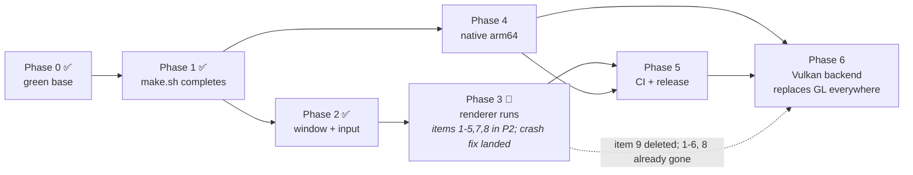

# macOS Port Plan

Status: **Phases 0, 1 and 2 landed; Phase 3 in progress** — PRs open on all three forks, CI for
Phase 0/1 green on all three platforms. Phase 3 is now **smaller** than originally planned: Phase 2
had to pull its minimum forward, the first Phase 3 session found and fixed a renderer crash, and the
second found and fixed the renderer half of the gate (Deviations #24), built the deterministic scene
the comparison needs (#25), and showed that what is left is the voxel data source, not the renderer
(#26).
See [Next session](#next-session) to pick up, [Progress](#progress) for branches, SHAs and evidence,
and [Deviations](#deviations-from-this-plan) for what implementation turned out to differ from this
document.

Goal: Bonsai builds and runs on macOS, alongside Windows and Linux.

---
## Next session

**Phase 3 — renderer runs: in progress.** Items 1–5, 7 and 8 landed in Phase 2 (Deviations #13).
The first Phase 3 session (2026-09-14) landed a renderer-crash fix, set up both `port/macos-phase3`
branches, and established the Linux reference the gate needs. What is left is in
[Phase 3 progress](#phase-3--renderer-runs-in-progress); the items below, minus what that session
already closed.

What is left of Phase 3, in priority order:

1. **The voxel data source on macOS** — the gate's remaining half, and the only thing between Phase 3
   and done. The renderer is verified (#25: the smoketest scene is identical on both platforms), and
   the defect is localised to the terrain-shaping → `R32UI` → PBO readback → finalize path (#26).
   **Start with the third standalone probe** described at the end of #26, using the shape of the two
   already in `examples/tools/macos_gl_probes/`: render a known pattern into an `R32UI` attachment the
   way `render_init.cpp:769` does, read it back the way `render_loop.cpp:762` does, compare every
   texel. If it comes back clean, then ask whether `terrain_gen` renders coherently on Linux — that
   separates "Apple's readback diverges" from "world generation is broken on both platforms and macOS
   merely makes it visible".
2. **`terrain_gen` and `blank_project` under the fixed renderer.** Both run clean, but neither has been
   looked at *with a frame* since #24 landed, and each needs the pinning of #25 before any comparison
   means anything. The dump probe is deliberately not in the tree — re-add it, pinned, per the
   verification method below.
3. Item 6 — the world-edit path. Blocked on brush assets, but the root cause is a **reader bug, not
   stale assets** (#18/#21): the version-shim structs are wrong, so the files are repairable, and
   regeneration is not actually possible the way #18 assumed.
4. Item 9 — `SetVSync`, dead code with no live callers. Decision made, recorded as #19.
5. Optional, and now cheap: **spike 6.0b** has only its measurement half left (frame time and heap
   bytes per unit of world, `terrain_gen` at 1920x1080). The padding itself is landed and load-bearing
   (#24), so the "win or only a cost?" question is now about the 20% vertex memory, not about whether
   to do it at all.

Branches already exist locally, created per the original recipe. **Do not re-run it**, and do not
expect a PR yet — none exists (see [Branches and PRs](#branches-and-prs)):

```bash
cd external/bonsai_stdlib && git fetch origin && git checkout -b port/macos-phase3 origin/port/macos-phase2
cd ../..                   && git fetch origin && git checkout -b port/macos-phase3 origin/port/macos-phase2
```

`bonsai_debug` is not in the stack and has no PR — only branch it if Phase 3 turns out to need a
change there, and leave that on the fork branch too (Deviations #16).

Gotchas that cost time in Phase 1, 2 and the first Phase 3 session, in order of how expensive they
were:

1. **Apple's core-profile GLSL compiler segfaults on an empty `case` body.** `case 3: {} break;`
   inside a `switch` in a `#version 410 core` shader kills `glLinkProgram` with SIGSEGV in
   `glpLLVMCGSwitchStatement`. A comment-only body counts as empty. This is the single largest
   surprise of Phase 2 and it cost more time than everything else combined — see Deviations #14.
   Before adding any `switch` to a shader, look at the existing ones in
   `shaders/composite.fragmentshader` and `shaders/terrain/world_edit.fragmentshader`.
2. **`glDrawArraysIndirect` crashes Apple's driver.** Intermittent SIGSEGV in
   `gldRenderVertexArray` under Rosetta, reached only through that entry point. Fixed in Phase 3
   by drawing directly — Deviations #21 has the isolation table.
3. **Build on Linux before pushing anything that touches a shared header.** `uintptr_t` compiled
   cleanly on macOS and broke Linux CI with 18 errors. Docker recipe is under
   [Phase 1 progress](#phase-1--makesh-completes-done) — `--platform linux/amd64` is required.
   **And build Linux in a copied tree**: mounting the repo with `-v $PWD` points the container's
   `./bin` at the host's, so a Linux build silently overwrites the macOS binaries (Deviations #23).
4. **A GLSL version bump is a hard stop, not a warning.** `CheckShaderCompilationStatus` calls
   `Error`, which traps the process. So any shader that fails to compile takes the engine down at
   startup rather than degrading.
5. **Never write `Jesse` in a comment you author** — that is the upstream maintainer. Use
   `NOTE(nsillik)` / `TODO(nsillik)`. See `AGENTS.md`.
6. **Never push or PR to `scallyw4g/*`.** Verify with
   `gh pr list -R scallyw4g/bonsai --author=@me --state=open`.
7. **Do not run `gh stack`** — it resolves to the parent repo and will try to open upstream PRs.
8. **Pass `-R nsillik/bonsai`** to `gh` commands; `branch.master.remote` points at `upstream`.
9. macOS builds are x86_64 and run under Rosetta 2. `ARCH` is the **target** arch, not the host arch.
10. **Driving the machine to verify input is a user-visible act.** Do not post synthetic events to
    the user's desktop; ask them to press keys and read the engine's log.
11. **Engine log output is buffered and is lost on a trap.** `PrintToStdout` uses `fwrite` into a
    `FILE*`, and `log.txt` likewise, so a SIGTRAP/SIGSEGV loses the tail. Any per-frame probe must
    write to stderr and `fflush` — an `Info()` tail that looks like it says where the crash was is
    just wherever the buffer happened to flush. This wasted a round of crash localisation.
12. **Do not compare frames across runs of `terrain_gen`** — chunk meshing is async, so frame 400 is
    a different scene on a fast machine than on a slow one (measured: 45% of the bytes differ between
    two runs of the same binary), and its day/night cycle advances with wall-clock `dt`. Use
    `examples/macos_smoketest/` for parity work, and remember that `tDay` must be *measured* for
    brightness, not guessed (Deviations #25).
13. **A frame dump needs a *state* pin, not a frame index, and the probe is not in the tree.**
    `terrain_gen` looks different on every run at frame 400; dump only when both work queues have been
    drained for ~60 frames and `tDay` is fixed. Re-add the dump block per the verification method
    below rather than assuming it is still there (Deviations #25).
14. **`docker run` in a tool call dies with the call, and the Linux run script's `cp` never fires.**
    Start the container detached, and `docker cp` the frame out while it is still running — the engine
    does not exit on its own. Cache the apt layer in an image; a repeat Linux run is then build-only.
15. **`screencapture` of the whole desktop captures the user's private content.** The engine can
    dump its own back buffer instead: `glReadPixels` + `WriteBitmapToDisk` (`bitmap.cpp:203`), read
    back on the render thread just before `BonsaiSwapBuffers`. It needs `glBindFramebuffer(0)` and
    an explicit `glBindBuffer(GL_PIXEL_PACK_BUFFER, 0)` first — see Deviations #22 for both traps.

---


## Decisions

| Decision | Choice | Rationale |
|---|---|---|
| Target arch (first) | x86_64 (Rosetta 2) | Verified working on M4 Max today: an x86_64 AppKit binary builds, creates an `NSOpenGLProfileVersion4_1Core` context and runs under Rosetta. Zero SIMD work to a running engine. Native arm64 follows as a bounded Phase 4. |
| Base | Fix-forward on new branch `port/macos` off `master` (`3813daac`) | Phase 0 also un-reds Linux, so CI gives real signal for everything after it. |
| Tooling | New cross-platform `.mise.toml`; Linux CI converted to mise; Windows keeps MinGW | One file, per-OS package and tool filters. Windows is the least-exercised path — leave it alone. |
| Long-term rendering API | Vulkan (Phase 6), MoltenVK on macOS | One API on all three platforms instead of permanent GL/Vulkan dual maintenance. Keeps SSBOs, compute and per-draw indexing, so it deletes Phase 3's GL 4.1 downgrade rather than living alongside it. |

Merges land to `master` per-phase, not as one mega-PR. Phase 0 and Phase 1 are independently
reviewable; Phase 3 is the mergeable-to-master milestone; Phase 4 is separate. Phases are developed
as **stacked PRs** — branch per phase, base = previous phase's branch — so each is reviewable and CI'd
on its own. Merge bottom-up.



Phase 6 (Vulkan) is a renderer rewrite rather than a platform port, and is deliberately larger than
Phases 0–5 combined. It is included here because it is the only item that changes the architecture
instead of adapting to it — but nothing before it depends on it.

Phase 0 spans **two repositories** and must land in order: `bonsai_stdlib` PR → its `master` →
bump the `external/bonsai_stdlib` gitlink in `bonsai` → CI goes green.

---

## Progress

### Repository layout

All work happens in forks. **Nothing is pushed to `scallyw4g/*`** — verified: zero branches matching
`port/` on either upstream, and no *open* PR authored there.

One correction to that attestation, found when the phase 3 branches were pushed: there **is** a
closed PR on `scallyw4g/bonsai` — [#8](https://github.com/scallyw4g/bonsai/pull/8), "Add posix stubs
for `PlatformInitializeAudio` and `PlatformPinCurrentThreadToCore`", from `nsillik:port/macos`, opened
and closed on 2026-09-14 before this session. It is closed, nothing is open against upstream, and
`AGENTS.md` says not to touch anything owned by someone else, so it is recorded here and left alone.
`scallyw4g/bonsai_stdlib` has no PRs at all.

| Remote | `bonsai` | `external/bonsai_stdlib` |
|---|---|---|
| `origin` | `nsillik/bonsai` | `nsillik/bonsai_stdlib` |
| `upstream` | `scallyw4g/bonsai` | `scallyw4g/bonsai_stdlib` |

`.gitmodules` uses relative URLs (`../bonsai_stdlib.git`), which resolve against the **fork**, so
`git submodule update --init --recursive` requires fork copies of `bonsai_stdlib` *and*
`bonsai_debug`. Both exist. The stale `scripts` entry has no gitlink in the tree (it is a plain
directory), so `git submodule update` ignores it.

### Branches and PRs

Stacked bottom-up, one branch per phase, in the two repos that hold reviewable changes:

```
master
 └─ port/macos               bonsai#1  stdlib#1   Phase 0
     └─ port/macos-phase1    bonsai#2  stdlib#2   Phase 1
         └─ port/macos-phase2  bonsai#4  stdlib#3  Phase 2
```

| Repo | Branch | Head | PR |
|---|---|---|---|
| `bonsai` | `port/macos` | `b7ef48c7` | [#1](https://github.com/nsillik/bonsai/pull/1) |
| `bonsai` | `port/macos-phase1` | `922c1dcf` | [#2](https://github.com/nsillik/bonsai/pull/2) |
| `bonsai` | `port/macos-phase2` | `11e2502f` | [#4](https://github.com/nsillik/bonsai/pull/4) |
| `bonsai_stdlib` | `port/macos` | `6b80224` | [#1](https://github.com/nsillik/bonsai_stdlib/pull/1) |
| `bonsai_stdlib` | `port/macos-phase1` | `82974dc` | [#2](https://github.com/nsillik/bonsai_stdlib/pull/2) |
| `bonsai_stdlib` | `port/macos-phase2` | `a7d2dd3` | [#3](https://github.com/nsillik/bonsai_stdlib/pull/3) |
| `bonsai` | `port/macos-phase3` | `c2b32422` | **pushed, no PR yet** |
| `bonsai_stdlib` | `port/macos-phase3` | `930f51e` | **pushed, no PR yet** |
| `bonsai_debug` | `port/macos-phase2` | `b6ceecb` | **none — deliberate** |

**`bonsai_debug` is a third fork, and is deliberately not a PR.** Phase 2 needed one change there
(Deviations #16) — a one-character assertion relaxation. That does not warrant a third repository in
the review surface, so per `AGENTS.md` ("if a change belongs upstream, leave it on a fork branch and
say so") it stays on the fork branch. `external/bonsai_debug` is pinned at
`nsillik/bonsai_debug` `port/macos-phase2`, and **`nsillik/bonsai_debug` must exist** for
`git submodule update --init --recursive` to resolve. The branch must stay too: the gitlink points at
it, so deleting it breaks a fresh clone.

If that commit is ever wanted upstream, it is `b6ceecb` on `port/macos-phase2`, based on `master`.

Linked as GitHub native Stack **#3** (done by hand in the web UI — see Deviations). Merge
bottom-up; `external/bonsai_stdlib` is pinned at the fork's `port/macos-phase2` (`a7d2dd3`) and must
be re-pointed at upstream `master` if these PRs are ever accepted upstream.

### Phase 0 — green base: done

`bonsai` `b7ef48c7`, `bonsai_stdlib` `6b80224`. Same fixes as specified above, plus:

- `.github/workflows/build.yml` — `pull_request.branches` was `["develop"]`, so a PR against the
  default branch (`master`) started **no jobs at all**. This is not in the plan but is required to
  observe Phase 0's gate from a PR. Later removed entirely (see Phase 1).
- `src/engine/engine_resources.h:182` — uncommented the `Input` binding. One line fixes all 13
  Windows sites.

CI [`34856272505`](https://github.com/nsillik/bonsai/actions/runs/34856272505): `build-ubuntu-22`
and `build-and-release-windows` both **success**. First green CI since 2025-12-17.

### Phase 1 — `./make.sh` completes: done

`bonsai` `922c1dcf`, `bonsai_stdlib` `82974dc`. Gate **exceeded**: the plan asked that
`RunTests` merely *run*, with failures deferred to Phase 2. It passes 10/10 suites on both
platforms.

Everything in the Phase 1 section below was implemented as written, except that the macOS platform
backend landed here rather than in Phase 2 — see Deviations.

CI [`34860403419`](https://github.com/nsillik/bonsai/actions/runs/34860403419), all three jobs green:

```
build-ubuntu-22            success   (Tar/Release skipped: tag-gated)
build-and-release-windows  success
build-macos                success   (new)
```

Local, from a clean tree (`rm -rf bin`):

| Platform | Build | Tests | Products |
|---|---|---|---|
| macOS 26.5.2 / M4 Max, Apple clang 21 | exit 0 | exit 0, 10/10 suites | x86_64 Mach-O, run under Rosetta 2 |
| Linux x86_64, clang 18 (Ubuntu 24.04) | exit 0, 18/18 targets | exit 0 | x86_64 ELF |

Also verified on macOS: `mise run build` and `mise run test` exit 0; `mise ls clang` is empty and
`mise bootstrap packages apply --dry-run` reports no packages, confirming the `os = ["linux"]` filter
is honoured.

**Reproducing the Linux check.** `docker run --platform linux/amd64 ubuntu:24.04`, then
`apt install clang-18 libx11-dev freeglut3-dev` and `PATH=/usr/lib/llvm-18/bin:$PATH`. The
`--platform linux/amd64` is load-bearing on an arm64 host: the default pull gets an
`aarch64-conda-linux-gnu` clang, which hard-errors on `-mssse3 -mavx -mavx2 -mfma` for reasons
unrelated to the code.

### Phase 2 — window opens, tests pass: done

`bonsai` `11e2502f`, `bonsai_stdlib` `a7d2dd3`, `bonsai_debug` `b6ceecb`. Gate **met**: `./bin/game_loader`
opens a window, renders terrain and UI, and exits 0.

Local, macOS 26.5.2 / M4 Max, Apple clang 21, x86_64 under Rosetta 2:

| Check | Result |
|---|---|
| `./make.sh` from a clean tree | exit 0, 0 errors |
| `./make.sh RunTests` | exit 0, 10/10 suites |
| `./bin/game_loader` | window opens, terrain + UI render, exit 0 on close |
| Linux `./make.sh`, Docker `--platform linux/amd64`, clang 18 (Ubuntu 24.04) | exit 0 |

Input was verified by reading what the engine actually received, not by inspection. `offsetof()`
against the real `input` struct gives the expected byte offset of every field, and each key that was
pressed landed on exactly the right one:

| Key | keyCode | Field | Offset | | Key | keyCode | Field | Offset |
|---|---|---|---|---|---|---|---|---|
| `W` | 13 | `W` | 660 | | `.` | 47 | `Dot` | 228 |
| `A` | 0 | `A` | 396 | | `/` | 44 | `FSlash` | 252 |
| `Z` | 6 | `Z` | 696 | | `return` | 36 | `Enter` | 0 |
| `5` | 23 | `N5` | 336 | | `esc` | 53 | `Escape` | 12 |

Shift, Control and Option each set only their own field (`raw=0x20102`→shift, `0x40101`→ctrl,
`0x80120`→alt) and cleared on release. LMB, RMB and MMB down/up all reached their fields. Scroll read
`scrollingDeltaY` and scaled a line-based wheel by 120, matching Linux/win32. A resize drag produced a
continuous stream of `ScreenDim` updates (982×564 → 891×465) with the render thread still drawing.
`esc` and the close button both exited 0.

Two notes on the verification method: the input checks were done with temporary `Warn` logging in
`macos_platform.cpp`, since removed (the committed diff contains no `INPROBE`); and the first
attempt at it posted synthetic CGEvents to the user's desktop, which is not acceptable — see
Deviations #15.

**Not verified in Phase 2**, and the reason Phase 3 is still open: the world-edit path (a brush
actually editing terrain) has never run, and `terrain_gen`/`blank_project` have not been launched.

---

## Deviations from this plan

Corrections found during implementation. Each is recorded where it was discovered, in the
Phase 0/1/2 sections below; this is the index.

### 1. Phase 1 needed the Phase 2 platform backend (~485 lines)

This plan puts `macos_platform.{h,cpp}` in Phase 2 and only build-script changes in Phase 1. That
does not work: `platform.h` and `platform.cpp` must dispatch *somewhere* for `BONSAI_MACOS`, and
`./make.sh` must **link**, which requires every window/OS symbol to be defined. So Phase 1 already
created the file: `macos_platform.h` (158 L) + `macos_platform.cpp` (327 L).

Consequence: Phase 2 is now only the *interactive* and *correctness* work — key/mouse mapping, Retina
assertions, live resize, and making tests pass — not the creation of the backend. The plan's "~500 L"
estimate was accurate; it just landed one phase early.

### 2. Objective-C++ is required, and applies to every target

Not anticipated. The engine is one translation unit per target, and `macos_platform.cpp` uses AppKit
directly, so the macOS block sets `-x objective-c++` and **all** macOS targets compile as
Objective-C++. There is no `.mm` shim, contrary to the usual approach. Two consequences: Objective-C++
accepts a superset of C++ so the rest of the tree is unaffected, and any future macOS-specific code
can use AppKit inline rather than needing a boundary.

### 3. `Fract` collides with the SDK (blocked the build outright)

Not anticipated, and the single largest surprise. `<MacTypes.h>` declares `typedef SInt32 Fract;`,
and it arrives transitively through **every** Foundation-based header — Cocoa, AppKit, Foundation,
`NSWindow.h`, `NSEvent.h`. Only `<OpenGL/OpenGL.h>` is clean. C++ does not let a typedef and a
function share a name, so `maff.h`'s `f32 Fract(f32)` fails with:

```
error: redefinition of 'Fract' as different kind of symbol
```

→ 18 cascading errors across `maff.h`, `noise.h`, `random.h`, `perlin.h`, `entity.cpp`.
`macos_platform.h` renames the SDK's typedef for the duration of the include:

```c
#define Fract BonsaiSdkFract
#import <Cocoa/Cocoa.h>
#undef Fract
```

`MacTypes.h` is include-guarded, so the rename is one-shot and consistent. The alternative — renaming
our `Fract` — touches four headers plus a call site in a submodule we do not own, to fix a name that
is fine on Linux and Windows. **Flagged on the PR as worth a second opinion.**

### 4. `link_weak` does not exist on Darwin; needed `-Wl,-U` per hook

Not anticipated. `link_weak` is `extern "C" __attribute__((weak))` — the ELF rule for "may be
undefined; bind to 0". ld64 has no equivalent for a **main executable**: it treats the reference as a
strong undefined symbol and fails the link. Measured: `weak_import` does not help either, because it
only relaxes a link against a dylib that *does* define the symbol.

`setup_for_cxx.sh` therefore names each hook explicitly with `-Wl,-U,_Symbol` — six of them:
`EntityUserDataSerialize`, `EntityUserDataDeserialize`, `EntityUserDataEditorUi`,
`GameEntityUpdate`, `BindEngineUniform`, `WorkerThread_BeforeSleep`. All are null-checked at their
call sites (`if (EntityUserDataSerialize)`), so a 0 binding is the intended behaviour.

Deliberately **not** `-Wl,-undefined,dynamic_lookup`, which links with one flag but disables
undefined-symbol checking for the whole link, turning genuine typos and missing libraries into
runtime crashes. Tradeoff: a new `link_weak` hook requires editing that list. Failure mode is a link
error naming the symbol, and the comment in `setup_for_cxx.sh` says so.

Any future port to a Darwin-like linker hits this. If it recurs, the alternatives are
`-Wl,-undefined,dynamic_lookup` (rejected above) or converting the hooks to function pointers
(`link_weak f(void)` → `link_weak f = 0`), which is the portable spelling and would be the right fix
if the list keeps growing.

### 5. `ErrnoToString` was **not** ported (plan said Phase 2 must supply it)

The Phase 2 list below names `ErrnoToString` alongside `PlatformCreateDir`/`PlatformDeleteDir` as
something `macos_platform.h` must supply. It has **zero callers**: the only reference in the tree is
commented out at `linux_file.cpp:126`, which `macos_platform.cpp` includes.

More decisively, it cannot be ported as written: the Linux version is a 745-line switch over 122
`errno` constants, and macOS defines only **85 of those 122**. So a copy would silently drop 37
cases, and the function would still `Assert(Result)` on any of them.

Decision: do not port it. If something ever needs errno strings on macOS, use `strerror(3)` — which
is what the macOS `PlatformSetThreadPriority` branch does. Removing it from the Phase 2 list.

### 6. `SetVSync`: the plan's item 9 is moot

Phase 3 item 9 (macOS branch in `gl.cpp`) and the Phase 2 list both reference `SetVSync`. It is still
never called — both call sites remain commented out (`initialize.cpp:72`, `linux_platform.cpp:89`),
exactly as this plan notes. The swap interval is instead set directly in
`OpenAndInitializeWindow` via `[NSOpenGLContext setValues:&n forParameter:NSOpenGLCPSwapInterval]`,
which is where the context is created and is the only place the value is available. No `gl.cpp`
change is needed unless `SetVSync` is ever wired up for both platforms.

### 7. Test discovery glob matched `.dSYM` bundles

Not anticipated. `run_tests.sh` globbed `./bin/tests/*`; on macOS clang emits a `.dSYM` bundle
directory beside every binary, so the loop tried to *execute* the directory and reported 90 spurious
suite failures on a fully-passing build. Now
`find ./bin/tests -maxdepth 1 -type f -perm -u+x`, shared with Linux. This is the kind of thing that
looks like 90 test failures and is not.

### 8. `uintptr_t` is not in scope in the platform headers — broke Linux

CI caught this on the first push of Phase 1, after it had compiled cleanly on macOS. 18 instances of
`unknown type name 'uintptr_t'` on `build-ubuntu-22`.

`<stdint.h>` is commented out in `primitives.h:156`, and neither `posix_platform.h` nor
`linux_platform.h` includes it. `uintptr_t` resolved on macOS only because the Cocoa headers happen
to drag it in — which is exactly the trap this whole phase is about.

→ Cast through `umm` instead: the codebase's own pointer-sized integer, asserted at
`primitives.h:81` (`CAssert(sizeof(umm) == sizeof(void*))`). No new include on either platform.

**Lesson for later phases: a clean macOS build is not evidence that a shared-header change is
portable.** Any edit to `posix_platform.{h,cpp}` must be built on Linux before pushing. See the
Docker recipe under Phase 1 progress above.

### 9. Stacked PRs trigger no CI without an extra change

`.github/workflows/build.yml`'s `pull_request.branches` filter matches the **base** branch. Phase 0
added `master` to it; that covers Phase 0's PR (base `master`) but **not** Phase 1's (base
`port/macos`), which reported "no checks reported" until the filter was removed entirely. Each PR in
a stack needs its own CI run. The `branches` filter is now absent from `pull_request`; `push` keeps
its `["master", "develop"]` filter.

### 10. `gh stack` CLI is unusable against a fork

`gh` v2.100.0 with the `gh-stack` extension (v0.1.1) resolves the repository to the fork's
**parent**: `gh stack init` writes `github.com:scallyw4g/bonsai` into `.git/gh-stack` regardless of
`gh repo set-default`. Its PR lookups then fail (`Could not resolve to a PullRequest with the number
of 1`) and `gh stack submit` attempts to create PRs on upstream — which is precisely the thing that
must not happen.

Workaround, and it works: open each PR with an explicit base

```bash
gh pr create -R nsillik/bonsai -H port/macos-phase1 -B port/macos
```

then group them into a native Stack **by hand in the GitHub web UI**. Confirm with:

```bash
gh api graphql -f query='{ repository(owner:"nsillik", name:"bonsai") {
  pullRequest(number:2) { stackEntry { position stack { number } } } } }'
```

Also: `branch.master.remote` was left pointing at `upstream` by the fork, so every `gh` command needs
`-R nsillik/bonsai` (or a one-time `gh repo set-default nsillik/bonsai`). `.git/gh-stack` was removed
so the CLI cannot be run accidentally.

### 11. mise's clang package ships no `clang++`

Worth knowing before Phase 5 or any CI change. On Linux, mise installs clang from the conda package,
whose `bin/` contains `clang`, `clang-18`, `clang-cl`, `clang-cpp` — **but not `clang++`**, and
`.mise-bins` does not add one. `make.sh` hardcodes `COMPILER="clang++"`.

It works on `ubuntu-22.04` runners only because the runner image supplies a `clang++` earlier in
`PATH`; `jdx/mise-action` prepends `.mise-bins` and shims, and the fallthrough finds the image's.
That is fragile. If Linux CI ever resolves the wrong compiler, this is why. Phase 5 should either
pin a `clang++` symlink explicitly or switch `make.sh` to `${CC:-clang++}`.

### 12. `run_tests.sh` prints an empty suite count (pre-existing, **not fixed**)

Two bugs in `run_tests.sh`, both upstream, both left alone — but they will mislead a reader of the
test output, so they are recorded here.

```bash
for test_executable in $(find $exe_search_string); do
  if $test_executable $COLORFLAG == 0; then     # <-- $COLORFLAG is undefined
    TESTS_PASSED=$((TESTS_PASSED+1))
...
echo "All Tests ($TESTES_PASSED) Passed"          # <-- typo: TESTES_PASSED
```

- `$TESTES_PASSED` on the final `echo` is a typo for `$TESTS_PASSED`, so the count always prints
  empty. That is why the output reads `All Tests () Passed`.
- `$COLORFLAG` is never set (the real variable is `POOF_COLOR_FLAG`), and `== 0` is passed to the
  test binary as literal argv. Harmless — the binaries ignore it and the `if` uses the **exit
  status** — but it is not the intended invocation.

**The exit code is correct**: `0` iff every suite exits `0`, non-zero counting failures. So
`./make.sh RunTests`'s exit status is a valid gate and Phase 1's 10/10 claim rests on
`ls bin/tests` (10 executables) plus an aggregate exit 0, not on the printed count.

Not fixed because it is shared harness behaviour outside this phase's scope, and `$COLORFLAG` may be
wired up elsewhere. Worth a one-char fix (`TESTES` → `TESTS`) whenever someone is in the file next.

### 13. Phase 2 could not reach its own gate — it needed Phase 3's items 1–5, 7, 8

The plan treats Phase 2 (window + input) and Phase 3 (renderer) as separable, with the gate for
Phase 2 being "`game_loader` opens a window". They are not separable: the renderer fails to
**initialize** on a 4.1 core context, and window creation and renderer init are the same call
(`InitializeBonsaiStdlib` → `OpenAndInitializeWindow` → `InitializeOpenglFunctions` →
`GraphicsInit`). There is no state in which the window exists and the renderer has not run.

Measured chain, from running `./bin/game_loader` at each step:

| # | Blocker | Evidence | Plan owner |
|---|---|---|---|
| 1 | `glMultiDrawArraysIndirect` absent → `Error` → SIGTRAP | `! Error - Couldn't load Opengl function (glMultiDrawArraysIndirect)` | P3 item 7 |
| 2 | `#version 460` unsupported → `Error` → SIGTRAP | `Error - Compiling Shader` in `GraphicsInit` | P3 item 1 |
| 3 | Profiler assert on a coarse cycle counter | `Assert(EndingCycle > StartingCycle)` at `debug.cpp:321` | unplanned, third repo |
| 4 | Empty `case` body segfaults Apple's GLSL linker | SIGSEGV in `glpLLVMCGSwitchStatement` | unplanned |

So Phase 2 landed Phase 3's items 1–5, 7 and 8. What that leaves of Phase 3 is in
[Next session](#next-session): item 6's world-edit path is converted but untested, item 9 is still
dead code, and the gate (`terrain_gen` + `blank_project` visual parity) is untouched.

Recorded rather than merged quietly because it changes what Phase 3 is. The alternative — landing
Phase 2 with the window gate unmet — was rejected: it would have shipped input mapping that nothing
could exercise, and a "window opens" claim with no window.

### 14. An empty `case` body segfaults Apple's core-profile GLSL compiler

The single largest surprise of Phase 2, and the only blocker that was not in any plan.

`shaders/composite.fragmentshader` had `case 3: {} break;` in a `switch` over a uniform int. Compiling
and linking that shader pair at `#version 410 core` kills `glLinkProgram` with SIGSEGV inside Apple's
own GLSL compiler:

```
libGLProgrammability.dylib  glpLLVMCGSwitchStatement
libGLProgrammability.dylib  glpLLVMCGNode -> glpLLVMCGBlock -> glpLLVMCGNode
libGLProgrammability.dylib  glpLLVMCGFunctionDefinition -> glpLLVMCGTopLevel -> glpLinkProgram
```

Reproduced standalone, deterministically (12/12), with the fragment shader alone — no engine code, no
buffers, no state. Narrowed by stubbing each top-level function in turn: removing any one of the four
segfaulted identically, which is what pointed at a shared construct rather than one function. `switch`
was the shared construct; the delta debugger reduced the 272-line shader to 223 lines with exactly one
`switch` left, the `agxLook` one, with `case 3: {}`.

Facts, all measured:

- **Deterministic.** 12/12 runs.
- **Not version-specific.** Crashes at `#version 330 core` and `#version 410 core` alike.
- **Core-profile only.** The same shader links fine on a legacy 2.1 context.
- **Empty means empty after comments.** `world_edit.fragmentshader` had no syntactically empty case
  bodies at all, and still crashed. Its three triggers were bodies containing only `/* ... */`
  comments: `case 0`, `case 2` and `case 4` of the `BlendType` switch. The comment-stripping scanner
  that found them reported nothing on the first pass because it was retracting braces incorrectly —
  worth knowing before trusting a scanner over a compiler.
- **A statement fixes it.** `Blended = Blended;` / `ColorValue = ColorValue;` / restating the defaults
  in `case 3` keep the behaviour identical and link cleanly. `case 3: break;` (no braces) is *not*
  verified — the control harness for that test was itself broken, so it was dropped rather than
  reported.

Fixed in `shaders/composite.fragmentshader` (1 case) and `shaders/terrain/world_edit.fragmentshader`
(2 empty + 3 comment-only). Total: 6 sites, 2 files. `shaders/composite.fragmentshader:112`,
`shaders/terrain/world_edit.fragmentshader:446,451,521,553,573`.

**There is no compiler diagnostic for this, and the failure mode is a SIGSEGV**, so the guard is
inspection: do not leave a `case` body without a statement on macOS. Noted in both shaders where it
was found, and in [Next session](#next-session) as gotcha #1.

### 15. Verifying input by driving the user's machine is not acceptable

To confirm the key/mouse mapping, the first attempt built a small tool that posted synthetic events
with `CGEventPost(kCGHIDEventTap, …)` at the user's desktop. It worked — it produced real keycodes
and real mouse events, and the mapping was confirmed with it. It was also wrong, and the user stopped
it.

The engine's input path can be verified by asking the user to press keys and reading the engine's own
log, which is what was done instead and gave strictly better evidence: the log reports the receiving
field's name and its byte offset, so each press is checked against `offsetof()` rather than against a
screenshot. No synthetic input tool, and no Accessibility permission, is needed.

Recorded as a deviation rather than a footnote because the constraint is not obvious from the plan,
and because "verify interactive behaviour" is exactly the kind of instruction that invites it. See
[Next session](#next-session) gotcha #9.

### 16. The profiler's cycle-counter assertion cannot hold under Rosetta

`debug_timed_function`'s destructor asserted `EndingCycle > StartingCycle`. `GetCycleCount()` is
`__rdtsc()` on this path, and under Rosetta 2 **RDTSC is not a core cycle counter** — it is the 24MHz
system timer. Measured on an M4 Max:

```
rdtsc consecutive-read delta: min_nonzero=41 max=6625 zero_deltas=1747651   (of 2,000,000)
1e6-iter loop: rdtsc delta=3046417  mach_absolute_time delta=3046084
rdtsc/mach ratio = 1.000
```

1.75M of 2M consecutive read *pairs* return identical values, and the smallest non-zero delta is 41
ticks. So any timed region shorter than one tick reads the same value twice, and the assertion fires
on healthy code — it traps in `~debug_timed_function` as soon as the render thread starts doing work.
arm64's `cntvct_el0` (Phase 4) ticks at the same rate, so Phase 4 would hit it too, natively.

→ `bonsai_debug` `b6ceecb` relaxes it to `>=`, which still catches a counter that rewinds — the thing
the assertion was actually protecting — and no longer fires on a counter that is merely coarse.

This lands in a **third fork**, `nsillik/bonsai_debug`, which the plan did not anticipate.

**It is deliberately not a PR.** The diff is one character plus a three-line comment; a third
repository in the review surface is the wrong trade for that, and `AGENTS.md` already says what to do
with a change like this — leave it on a fork branch and say so. `external/bonsai_debug` pins
`nsillik/bonsai_debug` `port/macos-phase2` (`b6ceecb`, based on `master`), and both the fork and the
branch have to keep existing or `git submodule update --init --recursive` breaks for a fresh clone.

The change itself is not optional: without it the engine traps in `~debug_timed_function` as soon as
the render thread starts doing work, on macOS *and* on Phase 4's native arm64.

### 17. `MaxFragShaderTexUnits` is queried and then never used

Not introduced by this work, but adjacent to it, and it matters for the TBO change. `render_loop.cpp`
does `GL->GetIntegerv(GL_MAX_TEXTURE_IMAGE_UNITS_ARB, &MaxFragShaderTexUnits)` and the value is
unused. `gl.h` does not declare `GL_MAX_TEXTURE_IMAGE_UNITS_ARB`, so that `pname` resolves through
whatever the platform's GL headers happen to define — it works, but it is not a value this tree
controls. Worth either using it to bound the texture-unit budget or deleting the query.

### 18. The brush assets on `master` no longer deserialize, and that is not new

`./bin/game_loader` prints ~55 `Reading Object Delim Failed` / `Deserializing v3i BasisOffset on
layer_settings_2` errors at startup, one per `.brush` in `brushes/`.

**Pre-existing, and not in the port's path.** Established by construction rather than by running the
old code, because Phase 1 traps at the GL loader before reaching any asset:

- `brushes/` is byte-identical between `port/macos-phase1` and `port/macos-phase2`.
- `src/engine/editor.h` (which holds `world_edit_op`, `layer_settings`, `brush_layer`) is byte-identical.
- `generated/serdes_vector_v3i.h` and the other deserializers are byte-identical.
- **12 commits on `master`** changed `src/engine/editor.h` *after* the `.brush` files were last
  written (`e29a657f`, "Finish up porting shape params to SSBO"), and none of them rewrote the assets.

So the serialized layout drifted from the struct on `master`, before this branch existed. Each failed
brush leaves `*CurrentBrush = {}` (`editor.cpp:29`), so the engine runs with empty brushes — which is
why the world editor does not demonstrate anything yet. A regeneration pass over `brushes/` is the
fix; out of scope here, and worth doing before the world-edit path is called verified.

**Correction from the first Phase 3 session, which changes this:** the assets are not the broken
part. See Deviations #21 — the version-shim *reader* is, and it means these files are repairable
rather than needing regeneration, which is not actually available without a working editor anyway.

### 19. `SetVSync` is dead code, and Phase 3 deliberately does not touch it

Confirmed twice more. `SetVSync` (`gl.cpp:36-57`, declared at `gl.h:650`) has no live caller. Both
referencing sites are commented out and were left commented: `initialize.cpp:72` and
`linux_platform.cpp:89`. The Windows side has no call site at all — the repo-wide grep finds
`SetVSync` only in `gl.cpp`, `gl.h`, `initialize.cpp` and `linux_platform.cpp`.

Decision: **leave it.** Three reasons, in order of weight:

1. The macOS swap interval is already set where the context is created
   (`macos_platform.cpp:198-199`, `NSOpenGLCPSwapInterval`, from the same `VSyncFrames` argument
   `initialize.cpp:67` passes). Adding a macOS branch to `SetVSync` would duplicate a value that is
   already honoured, and the plan's Phase 2 conclusion (Deviations #6) stands.
2. Enabling the other two arms would change Linux and Windows frame pacing. That is unverifiable
   here (CI has no display; this machine has no Linux GPU) and it is a behaviour change to platforms
   this port does not own. Upstream's own note at `gl.cpp:41` says vsync was *not* achievable on the
   machine it was tested on, so enabling it is not even known to help.
3. Deleting it would remove two upstream `TODO(Jesse)` markers with stable ids (`gl.cpp:41` id 151,
   `gl.cpp:54` id 368). Nothing else in the tree references those ids, but `AGENTS.md` says
   upstream's markers are upstream's — leave them alone.

Phase 6 replaces the whole function with `VK_PRESENT_MODE_FIFO_KHR`, so its lifetime is bounded and
the upstream TODOs survive it. If `SetVSync` is ever wired up for real, note first that
`SetVSync` calls `AssertNoGlErrors`, which expands to `GetGL()->GetError()` (`gl.h:6-11`) — the
loaded function table, which is zeroed until `InitializeOpenglFunctions()` runs. The commented site
at `linux_platform.cpp:89` sits *before* that, so un-commenting it as-is would dereference a null
function pointer. `initialize.cpp:72` sits after it and is the only correct place.

### 20. `terrain_gen` renders on macOS, and does not match Linux — the open gate

Established with a temporary `glReadPixels` dump of the engine's own back buffer (recipe in the
Phase 3 progress section), not a screenshot. Two frames per platform, taken at the same `FrameIndex`:

| | macOS, frame 400 (3440×1378) | Linux, frame 400 (4096×2160) |
|---|---|---|
| UI | all four debug windows, correct text and layout | same, correct |
| terrain | **streaky slabs at scattered depths, background visible through them** | coherent green plain with yellow foliage, filling the frame |

`terrain_gen` runs without crashing and draws correct UI text, so the 2D path is sound. The 3D scene
is not. The macOS frame at frame 400 shows the same defect as at frame 200, so it is not
initialisation noise.

Two candidates, neither confirmed. The plan's own risk table lists the second one:

1. **The per-draw transform index is wrong on macOS.** If `DrawIndex` does not line up with the
   transform it should read from the TBO, every chunk is drawn with another chunk's matrix — which
   is exactly what streaky misplaced geometry looks like. The plan itself names this risk:
   *"Descriptor-binding model changes (SSBO → TBO) silently drop the transform/edit-op data."*
   Cheapest discriminating experiment: make `MultiDrawIndirect` set `DrawIndexUniform` to a constant
   `0` for every draw. If the image collapses to every chunk drawn with chunk 0's transform in the
   same place as the broken image, the uniform is not reaching the shader on macOS.
2. **The 3-byte vertex fetch** (`v3_u8`, `stride = 0`, `gpu_mapped_buffer.cpp:459-463`). Apple's
   Metal-backed GL may not fetch tightly-packed 3-byte attributes correctly; Linux/Mesa does. This
   is spike 6.0b, previously optional — and note that the crash fixed in Deviations #21 lived in
   `gldRenderVertexArray`, the same code that would do this fetch, so the two symptoms may share a
   cause. Distinguishing test: pad to a 4-byte stride and re-compare. That is a real change (see the
   couplings table under Phase 6 → Blocker 1), so it is not a five-minute experiment.

Neither was confirmed before the session ended. **Do not assume either.** Run experiment 1 first;
it is a one-line edit to `render.cpp` and takes minutes. If it exonerates the transform path, move
to the stride, which is also the Phase 6 prerequisite.

### 21. `glDrawArraysIndirect` crashes Apple's driver — fixed by drawing directly

`terrain_gen` crashed on macOS with SIGSEGV, exit 139, inside Apple's own driver:

```
AppleMetalOpenGLRenderer  GLRResourceList::addResource(GLRResource*)      <- null resource
AppleMetalOpenGLRenderer  GLDContextRec::prepareResourceForGPUAccess(...)
AppleMetalOpenGLRenderer  gldRenderVertexArray(...)
GLEngine                  glDrawArraysIndirect_GL3Exec
terrain_gen_loadable      MultiDrawIndirect(...)                          render.cpp
terrain_gen_loadable      RenderDrawList / DrainHiRenderQueue
game_loader               RenderThread_Main
```

Measured properties:

- **Intermittent, not deterministic.** Always on the *first* draw of a batch, after 1000–1600
  commands have already gone through; 12 crashes in 13 runs of the pre-fix code. Not draw-count
  driven (crashes seen at batch sizes 989 and 1611) and not frame-count driven (crashed at frame 14
  in two runs, survived to frame 176 in another).
- **Reached only via the indirect entry point.** The identical draw issued as `glDrawArrays` never
  crashed, in 8/8 runs.
- **Not buffer orphaning.** Sizing the indirect buffer once and feeding it with
  `glBufferSubData` still crashed (3 of 5).
- **Not the per-draw uniform.** Dropping the `glUniform1i` from the loop still crashed.
- **Not the TBO.** Skipping `BindTextureBuffer` entirely still crashed.
- **Not synchronisation.** A `glFinish` after the loop did not prevent it.

`crashreporter` state at the fault (`$r14 == 0` in `GLRResourceList::addResource`) says the driver
was adding a null resource while preparing vertex-array state for the draw. Root cause inside
Apple's driver was **not** established; what was established is that the indirect path is the only
one that reaches it. `gldRenderVertexArray` is also where the rendering mismatch of Deviations #20
shows up, so the two symptoms may share a root.

Fix: draw directly. `BufferIndirectDrawCommand` (`render.cpp:958`) always writes `InstanceCount = 1`
and nothing reads `BaseInstance` — the shader takes its transform from the `DrawIndex` uniform, the
same thing this loop already sets per draw — so each command is a plain non-instanced draw, and the
indirect buffer was written every frame and read by nothing else. `MultiDrawIndirect` now issues
`glDrawArrays(GL_TRIANGLES, First, Count)` per command. The loop, the per-draw uniform and the
ordering are unchanged; the dead indirect buffer, its `glBufferData` and the now-pointless
4-byte-alignment `static_assert` are deleted, and `gl.cpp:193-198`'s comment updated to match.

Phase 6 restores the single-call form under Vulkan, where `gl_DrawIndex` is 1:1 with the original
`gl_DrawID`.

### 22. Two readback traps, found while building the frame-dump probe

Both are engine state, not probe bugs, and both will bite anyone verifying rendering this way.

1. **`CheckNoiseReadbackJobs` leaves `GL_PIXEL_PACK_BUFFER` bound.** After mapping a readback job it
   never unbinds (`render_loop.cpp:879` binds, `:881` maps, nothing unbinds). The next
   `glReadPixels` with a client-side pointer is then rejected with `GL_INVALID_OPERATION` (0x502)
   and writes nothing — the pixel sums came back zero and identical between frames, which looks
   exactly like "the renderer is drawing nothing". Unbinding explicitly before reading fixes it.
   Worth fixing properly at some point: `UnbindBuffer(GL_PIXEL_PACK_BUFFER)` after `MapBuffer`.
2. **The render pass leaves its own framebuffer bound**, so a readback must `glBindFramebuffer(0)`
   first. Combined with the pack buffer this produced `ReadErr 0x502` on some frames and clean
   reads on others — intermittent-looking, actually state-dependent.

Also: `WriteBitmapToDisk` writes rows as given, and `glReadPixels` returns them bottom-up, so a
correct-looking dump is upside down unless the rows are reversed first.

### 23. Mounting the repo into Docker clobbers the host's `bin/`

`docker run -v "$PWD":/src … ./make.sh` writes into `$PWD/bin`, which is the host's directory. The
first Linux verification run therefore overwrote every macOS binary in `bin/` with ELF objects
(`bin/game_loader` became an ELF x86-64 file) and left `*.so` next to `*.dylib` in `bin/game_libs/`.
Not noticed until a macOS run picked up the wrong binary — the engines are distinguished only by
extension, so both sets coexist and it is easy to run the wrong one.

→ Build Linux in a **copied** tree, not a bind mount of the working repo:

```bash
tar --exclude=.git --exclude=bin --exclude='*.dSYM' -cf - . | (cd /tmp/linuxsrc && tar -xf -)
docker run --rm --platform linux/amd64 -v /tmp/linuxsrc:/src …
```

That keeps `$PWD/bin` untouched and gives the Linux build its own `bin/` as well.

### 23a. The frame dump must **not** reverse its rows (correction to #22)

#22's last paragraph says a correct-looking dump is upside down unless the rows are reversed first.
**It is the other way round.** `WriteBitmapToDisk` emits rows in file order, and BMP stores rows
bottom-up, which is exactly the order `glReadPixels` returns; writing them as given is correct.
Reversing them produces the upside-down file, which is why the first Phase 3 session's frames looked
mirrored and were read as such. Measured, both ways, against a frame whose orientation is known.

### 24. The macOS↔Linux mismatch is Apple fetching 3-byte vertices at a 4-byte stride — FIXED

This is Deviations #20's open gate, resolved. **#20's candidate 1 (large `first` offsets) was
wrong**, and the two isolating experiments it proposed never had to be run: `LoadTransform(0)` and
`first = 0` both draw a *different chunk's mesh*, so those images were never comparable to the real
ones, which is why "forced 0 looks coherent" appeared to mean something it did not.

Established with two standalone offscreen GL 4.1 programs, kept in
`examples/tools/macos_gl_probes/` with a README saying how to build and run them (no window, no
pixels, nothing in `make.sh` — the vertex buffer holds a known pattern, and the vertices the driver
actually fetched are read back through transform feedback):

| idiom | result |
|---|---|
| `GL_BYTE` x3, stride 4, 4-byte-padded data | **0 of 57 (first x count) combinations wrong** |
| `GL_BYTE` x3, stride 0 — tightly packed 3 bytes | **57 of 57 wrong**, from the second vertex on |
| float x3 stride 12 | 0 of 57 |
| engine layout + `matl` via `VertexAttribIPointer` + separate normal buffer | 0 of 57 |
| large `first` (0 … 67,108,863) | innocent |
| per-draw `glUniform1i(DrawIndex)` + `texelFetch(samplerBuffer)` over 1700 draws x 60 frames | innocent, 0 mismatches in 226,936 checks |

With `stride = 0` the driver reads at a 4-byte stride, so every vertex after the first is assembled
from the wrong bytes — `got (0,68,62)` where the data says `(68,56,62)`, a one-byte shift. That is
what turned every chunk mesh into the slivers of #20's table, and why the packed layout renders
correctly on Mesa and incorrectly on Apple.

**Fix** (in `bonsai_stdlib`, three files): `v3_u8` is `alignas(4)` so `sizeof(v3_u8) == 4`, the
element-size table is declared as `sizeof(v3_u8)`, and the two attribute pointers use
`sizeof(v3_u8)` as their stride instead of `0`. Every other `sizeof(v3_u8)` in the tree then means
"4 bytes on the GPU" and needed no edit. Cost is the +20% vertex memory spike 6.0b predicted; the
fourth byte is padding that nothing reads and the meshers do not write.

Two engine-side checks, both of which passed *after* the fix and neither of which was the cause:
the transform TBO is byte-identical to the CPU copy (0 of 1728 matrices differ), and the VAO reports
`size=3 type=GL_BYTE stride=4` for position and normal.

### 25. `terrain_gen` cannot be compared across runs; `macos_smoketest` exists for that

Two things that cost time in this session and will cost it again:

1. **`terrain_gen` is unusable for a frame comparison.** Its chunks stream in on worker threads, so
   how much of the world exists at a given `FrameIndex` depends on how fast the machine is: two runs
   of the *same* binary at frame 400 differed in **45% of the frame's bytes**. Its day/night cycle
   also advances with accumulated wall-clock `dt` (`api.cpp:515`), which changes the lighting between
   runs even at a fixed frame. Dumping "at frame N" is not a pin.
2. **`examples/macos_smoketest/` exists for this.** It defines the world by hand — a
   `chunk_completion_callback` overwrites the engine's noise buffer before voxels are finalized
   (`ChunkCompletionCallbacks`, invoked at `api.cpp:736-750`; bit 31 of each `u32` means "filled",
   the low bits are the voxel's material) — so the scene is a pure function of voxel position. With
   the camera aimed at the pattern, the day/night cycle off and `tDay` pinned, two macOS runs are
   **pixel-identical except a 15-row strip at the top of the frame**, which is the `EngineDebug`
   HUD's live FPS/dT numbers. `tDay` is not free to choose: `UpdateKeyLight` derives the sun's
   direction and colour from it, and most values put the sun below the horizon. Sweeping it and
   measuring the frame's mean luminance gives `0 -> 0.0, 1 -> 14.6, 3 -> 5.3, 5 -> 26.5, 6 -> 7.9`;
   the example pins `5`.

Gate result with that example, macOS (3440x1378) vs Linux (4096x2160, llvmpipe under Xvfb), both
rescaled to a common grid after cropping to a common aspect (`ScreenDim` is the display-clamped
window backing on macOS and the window/back-buffer size on Linux, so the raw grids differ):

| metric | macOS | Linux |
|---|---|---|
| geometry pixels | 12793 (3.9%) | 12558 (3.8%) |
| mean luma of geometry | 106.9 | 106.1 |
| mean RGB of lit geometry | (143, 93, 152) | (141, 92, 150) |
| pixels differing by more than 32 luma | 89 (0.03%) | |

The scene — a ground slab, a three-step staircase, a column and a ridge — renders the same on both.

### 26. The renderer is verified; what is still wrong is the **voxel data source**

The gate's remaining half, and it is not the draw path. Two runs of the *same* example, same camera,
same renderer, differing only in where the voxels come from:

| voxel source | result |
|---|---|
| hand-written in `examples/macos_smoketest/` | the full scene — ground slab, three-step staircase, column, ridge; measured identical to Linux (#25) |
| the engine's own GPU noise (`SMOKETEST_ENGINE_NOISE=1`) | **almost nothing** — a handful of sliver-like fragments in an empty world |

So `terrain_gen`'s landscape of long horizontal shelves with sky between them is a *data* defect, not
a rendering one: the geometry is drawn correctly from voxels that are not what the shading shaders
wrote. It also explains the wrong colours in that screenshot — the material bits are wrong too.

The path, in order, none of it verified today:

| stage | where |
|---|---|
| terrain-shaping shaders render into a ping-pong `RenderToTexture` pair (`RGB32F`) | `render_loop.cpp:655-715` |
| "Terrain Finalize" pass renders into `TerrainFinalizeRC.FBO`, a 2D `GL_R32UI` texture of `TextureDim = 64 x (66*66)` — the chunk volume packed into rows | `render_loop.cpp:723-739`, `render_init.cpp:683,769-770` |
| `ReadPixels(0, 0, TextureDim, GL_RED_INTEGER, GL_UNSIGNED_INT, 0)` into a `GL_PIXEL_PACK_BUFFER`, then a fence, pushed as a `finalize_noise_values` job | `render_loop.cpp:748-768` |
| `CheckNoiseReadbackJobs` maps the PBO | `render_loop.cpp:859-890` |
| voxels finalized from it — **bit 31 = filled**, low bits = material | `FinalizeOccupancyMasksFromNoiseValues`, `world_chunk.cpp:4458` |

Candidates, none confirmed:

1. **The `R32UI` render target and integer readback on Apple's GL.** Everything measured in #24 was
   vertex fetch, attributes, uniforms and texture-buffer fetches; integer-texture rendering and
   `GL_RED_INTEGER`/`GL_UNSIGNED_INT` readback are untouched by it.
2. **The shaping shaders themselves** — 410-core since Phase 2, and they are the only other place a
   texture buffer plus many texture units are used (`Assert(TexUnit <= SHADER_TEXTURE_BUFFER_UNIT)`
   at `render_loop.cpp:695` shows how close that gets to a collision).
3. **Row packing** — probably innocent: rows are 64 texels of 4 bytes = 256 B, already aligned for
   the default `GL_PACK_ALIGNMENT` of 4.
4. **The pack-buffer state leak in #22** (`CheckNoiseReadbackJobs` maps the pack buffer and never
   unbinds it). The readback binds its own PBO first (`render_loop.cpp:761`), so this is probably not
   it — but `glReadPixels(..., 0)` *is* "offset into the bound pack buffer" semantics, so it is worth
   ruling out explicitly rather than by argument.

**Portability note from the same measurements:** on this driver `glReadPixels` reads from
`GL_READ_BUFFER`, which defaults to `COLOR_ATTACHMENT0`; reading any *other* attachment needs an
explicit `glReadBuffer` (hit while reading the gBuffer's `gNormal` and `gPosition`). The noise
readback relies on the default being attachment 0, which holds today.

**Next step:** a third standalone probe, same shape as the two in #24 — render a known pattern into an
`R32UI` attachment the way `render_init.cpp:769` does, read it back the way `render_loop.cpp:762`
does, and compare every texel. That names the stage in one run. If it comes back clean, the next
question is whether `terrain_gen` renders coherently on Linux: if it does, Apple's readback diverges;
if it does not, world generation is broken on both platforms and macOS merely makes it visible.

---

## Research findings
Measured on Apple M4 Max, macOS 26.5.2 (Darwin 25.5), Apple clang 21.0.0 (Xcode 26.5),
mise 2026.9.5. Line numbers are from `master` `3813daac` / `bonsai_stdlib` `e11fa2b`.

### Baseline is already broken, independent of macOS

CI run [`34768972202`](https://github.com/scallyw4g/bonsai/actions/runs/34768972202)
(run #535, 2026-09-13) on HEAD `3813daac`. Logs read from the failed-job transcripts:

| Job | Result | Failure |
|---|---|---|
| `build-ubuntu-22` | failure | `external/bonsai_stdlib/src/initialize.cpp:52:3: error: use of undeclared identifier 'PlatformPinCurrentThreadToCore'`; `:93:5: error: use of undeclared identifier 'PlatformInitializeAudio'; did you mean 'PlatformInitializeMutex'?` and the cascade `:93:29: error: cannot initialize a parameter of type 'mutex *' with an lvalue of type 'platform *'`. 3 errors per TU. |
| `build-and-release-windows` | failure | `examples/turn_based/game.cpp` `Input` undeclared at 12 sites (673, 685, 697, 709, 721, 733, 746, 812, 829, 887, 924, 960) **and** `examples/the_wanderer/game.cpp:66`. 13 errors total. |

Last green `master`: **2025-12-17** (run #530, `07f79e0e`), **5 runs ago** — runs #531–#535 are all
red. 75 commits have landed since. Both missing symbols are win32-only, so Linux has lacked posix
stubs since Dec 2025. Any macOS work sits on a red base.

### Two real blockers

**Blocker A — x86 intrinsics are pervasive (kills native arm64).**

```
external/bonsai_stdlib/bonsai_stdlib.h:23-26
  #if !BONSAI_EMCC
  #include <x86intrin.h>  #include <immintrin.h>  #include <smmintrin.h>
```

Measured:

```
$ clang++ -c t.cpp                              # arm64-apple-darwin25.5.0 (default)
  immintrin.h:14:2: error: "This header is only meant to be used on x86 and x64 architecture"
$ clang++ -c t.cpp -mssse3 -mavx -mavx2 -mfma
  error: unsupported option '-mssse3' for target 'arm64-apple-darwin25.5.0'   (and -mavx, -mavx2, -mfma)
```

Surface: **72 distinct `_mm*` intrinsics across 148 occurrences**. Helpers `simd_sse.h` (186 L),
`simd_avx2.h` (463 L), `avx2_v3.h` (192 L); direct use in `src/engine/mesh.h` (16 lines),
`src/engine/terrain.cpp` (17 lines), `external/bonsai_stdlib/src/{vector,thread,maff,debug_print}.h`.
`BONSAI_NO_AVX` drops `simd_avx2.h`, `avx2_v3.h` **and** `perlin.h`
(`bonsai_stdlib.h:31-34`, `:71-73`) — SSE stays mandatory. Direct `__rdtsc`: `perlin.cpp:500`,
`src/engine/terrain.cpp:144,250,380,454`, plus `GetCycleCount()` at
`linux_platform.h:118` (fn at `:115`), `win32_platform.h:99`, `wasm_platform.h:13`.

The Rosetta path works end-to-end today:

```
$ clang++ -mssse3 -mavx -mavx2 -mfma -target x86_64-apple-macos11 -o avxtest avxtest.cpp && ./avxtest
  avx ok 2.000000
$ clang++ -target x86_64-apple-macos11 -framework Cocoa -framework OpenGL -o xtest xtest.mm && ./xtest
  sizeof(NSUInteger)=8 / NSOpenGLPixelFormat ok      # AppKit + GL 4.1 context under Rosetta
$ ./page_arm  → _SC_PAGESIZE=16384
$ ./page_x86  → _SC_PAGESIZE=4096                   # Rosetta reports 4 KiB pages, not 16 KiB
$ clang++ ... -shared -fPIC -lGL                    # ld: library 'GL' not found
$ clang++ ... -shared -fPIC -framework Cocoa -framework OpenGL -framework IOKit   # ok, Mach-O dylib
$ ./rd → __builtin_arm_rsr64("cntvct_el0") compiles and runs on arm64
```

**Blocker B — macOS GL is 4.1 / GLSL 4.10; the renderer needs 4.3–4.6.**

Measured with a real `NSOpenGLProfileVersion4_1Core` core context:

```
GL_VERSION  : 4.1 Metal - 90.5
GL_RENDERER : Apple M4 Max
GLSL        : 4.10
MAX_TEXTURE_BUFFER_SIZE = 268435456
MAX_UNIFORM_BLOCK_SIZE  = 65536
glBindBuffer(GL_SHADER_STORAGE_BUFFER,…) → GL_INVALID_ENUM (0x500)
shader "#version 460/450/440/430/420 core" → FAILED (version not supported)
shader "#version 410 core"                 → COMPILED
shader "#version 330 core"                 → COMPILED
```

`gl.cpp` makes **132 `PlatformGetGlFunction` calls**; **130** of them are gated with
`Initialized &= fn != 0` (one gate is copy-pasted: `VertexAttribIPointer` is checked against
`VertexAttribPointer` at `gl.cpp:225-226`). **9 entry points are absent on macOS**, all confirmed
`absent` via `dlsym(RTLD_DEFAULT, …)` in a live 4.1 core context:

`glMultiDrawArraysIndirect` (`gl.cpp:129`) · `glBindTextures` (`:144`) · `glBufferStorage` (`:411`) ·
`glGetQueryBufferObject{iv,uiv,i64v,ui64v}` (`:475,478,481,484`) · `glGenerateTextureMipmap` (`:488`) ·
`glDebugMessageCallback` (`:429`)

→ `Ensure(InitializeOpenglFunctions())` (`initialize.cpp:71`) fails. The engine cannot start.

Only two of those are actually *called*: `glMultiDrawArraysIndirect` at `render.cpp:1746` (the hit
at `:1344` is commented out) and `glGenerateTextureMipmap` at `ui/ui.cpp:3580`. `glBindTextures`,
`glBufferStorage` and `glGetQueryBufferObject*` have zero call sites; `glDebugMessageCallback`'s
only call is commented at `gl.cpp:513`.

Measured substitutes:

| Needed | macOS substitute | Status |
|---|---|---|
| `glMultiDrawArraysIndirect` | loop of `glDrawArraysIndirect` (present) or `glMultiDrawArrays` (present) | ✅ |
| `glBindTextures` | `glActiveTexture` + `glBindTexture` (unused anyway) | ✅ |
| `glGenerateTextureMipmap` | `glActiveTexture` + `glBindTexture` + `glGenerateMipmap` (present) | ✅ |
| `glBufferStorage` | `glBufferData` (unused anyway) | ✅ |
| `glGetQueryBufferObject*` | unused → stop requiring | ✅ |
| `glDebugMessageCallback` | absent; unused, call commented at `gl.cpp:513` | ✅ |
| **SSBO** (`gBuffer.vertexshader:28`, `terrain/world_edit.fragmentshader:72`) | **TBO** — `glTexBuffer` present, `MAX_TEXTURE_BUFFER_SIZE = 268435456` | ✅ |
| `#version 460 core` | `410 core`, add `ShaderLanguageSetting_410core` | ✅ |

`gl_DrawID` at `shaders/gBuffer.vertexshader:53` is GLSL 4.60 (`ARB_shader_draw_parameters`) —
unavailable at 4.10 — it must become a per-draw index uniform. `MAX_UNIFORM_BLOCK_SIZE` is only
65536, which is why TBO beats UBO for the transform buffer.

Two extension-list traps, both measured:

- `GL_ARB_texture_buffer_object` is **not** in `glGetStringi(GL_EXTENSIONS)` (43 extensions
  total), but TBOs are core since GL 3.1 and `glTexBuffer` is present. Do not gate on the
  extension string.
- `GL_ARB_explicit_uniform_location` is absent, and `header.glsl:3` does
  `#extension GL_ARB_explicit_uniform_location : enable`. That is a **driver warning, not an
  error** — verified; no shader uses `layout(location=)` on a uniform.

#### Measured shader audit (replaces guesswork for Phase 3)

Reproducing the engine's exact preamble (`ValueFromSetting(…)` + `header.glsl` + raw shader file,
two-source `glShaderSource` as in `shader.cpp:26`) against the live 4.1 core context:

| Preamble | Compiled |
|---|---|
| `#version 460 core` | **0 / 56** |
| `#version 410 core` | **54 / 56** |
| `#version 330 core` | 54 / 56 |

The only two failures at 410 are the SSBO ones:

```
FAIL shaders/gBuffer.vertexshader            ERROR: 0:918: 'buffer' : syntax error
FAIL shaders/terrain/world_edit.fragmentshader ERROR: 0:962: 'buffer' : syntax error
```

56 = 47 `.fragmentshader` + 9 `.vertexshader`; plus `external/bonsai_stdlib/shaders/header.glsl`
= 57 files, none of which declares `#version` (the version is injected at runtime).

### What ports cleanly

Every POSIX/API the stdlib uses compiles on macOS: `mmap` + `MAP_NORESERVE`, `mprotect`, `sem_*`
(deprecated → warnings only; no `-Werror` anywhere), `clock_gettime(CLOCK_MONOTONIC)`,
`pthread_mutex_*`, `pthread_setschedparam`, `nanosleep`, `backtrace`, `ftw`, `arpa/inet.h` /
`sys/socket.h`, `dlopen`/`dlsym`.

`linux_file.cpp` (252 L) is portable as-is. `posix_platform.{h,cpp}` (195 + 330 L) need exactly
one edit for the Rosetta path (see Phase 2).

`bonsai_debug` needs no work — its only platform split is `#if BONSAI_WIN32` (ETW).

Engine threading already matches Cocoa's constraints:

| Work | Thread | Cocoa-safe |
|---|---|---|
| `OpenAndInitializeWindow` (`initialize.cpp:68`) | main | ✅ NSApp/NSWindow must be main |
| `ProcessOsMessages` (`api.cpp:458`, via `Bonsai_FrameEnd` at `:423`) | main | ✅ NSEvent pump |
| `PlatformMakeRenderContextCurrent` (`render_loop.cpp:925`) | render | ✅ `makeCurrentContext` + CGL lock |

Linker flags must diverge: `-lGL` fails hard (`library 'GL' not found`); use
`-framework Cocoa -framework OpenGL -framework IOKit`. `-shared -fPIC` correctly emits a Mach-O
dylib. `-lpthread` / `-ldl` both resolve.

### mise capability

- `[tools] clang` resolves via `conda:clang` / `asdf:mise-plugins/mise-llvm` /
  `vfox:mise-plugins/vfox-clang`; `18.1.1` … `23.1.1` available. Pin `18.1.8` (readme requires
  ≥ 18.1; `docs/01_build_process.md:6` still says 15 and is stale).
- **Per-OS filtering works on `[tools]` too**, not just `[bootstrap.packages]`: verified that
  `clang = { version = "18.1.8", os = ["linux"] }` is skipped on macOS. This is required — a bare
  `clang = "18.1.8"` would install LLVM on macOS and shadow Apple clang, contradicting the
  caveat below.
- `[bootstrap.packages]` supports per-OS filtering (`os = "linux"` / `"macos"` / list) and skips
  unavailable managers with a warning, so one cross-platform file works. `brew:` needs no
  Homebrew installed, on macOS or Linux.
- **Caveat:** on macOS the real toolchain dependency is Xcode Command Line Tools, which mise
  cannot install. Use system Apple clang on macOS; the mise clang pin is for Linux.
- **CI caveat:** runners have no mise. The workflow needs `jdx/mise-action` (or an equivalent
  install step) before `mise bootstrap … && mise install`.

---

## Phase 0 — green base

**DONE.** `bonsai` `b7ef48c7` / `bonsai_stdlib` `6b80224`, PRs `bonsai#1` + `stdlib#1`.

Prerequisite for macOS and fixes existing Linux/Windows CI.

### `external/bonsai_stdlib` (branch `port/macos`, PR to its `master`)

| Symbol | File | Change |
|---|---|---|
| `PlatformPinCurrentThreadToCore(u32)` | `src/platform/posix_platform.h` | inline no-op returning `False` (win32 twin at `win32_platform.cpp:168`) |
| `PlatformInitializeAudio(platform*)` | `src/platform/posix_platform.cpp` | stub → `Warn(...)`, `return False`, matching `struct audio { b32 Initialized; }` (`posix_platform.h:44`) |

Do **not** stub `PlatformShutdownAudio` / `PlatformPlaySoundBuffer`: they are referenced only from
win32 code and from inside `#if BONSAI_WIN32` in `src/engine/sound.h:163`. No posix TU needs them.

The stub must exist for Linux *and* macOS — both include `posix_platform.h`, so one declaration
covers both, and Linux CI goes green without macOS existing yet.

### `bonsai`

- `src/engine/engine_resources.h:183` — uncomment
  `input *Input = &Res->Stdlib.Plat.Input;` inside `UNPACK_DATA_RESOURCES`.
  This is the real Windows fix. `UNPACK_ENGINE_RESOURCES` is **already present** at
  `turn_based/game.cpp:650` and `the_wanderer/game.cpp:37`, which is why adding the macro cannot
  help; and `UNPACK_STDLIB` (`bonsai_stdlib.h:113-115`) only declares `Os`/`Plat`. Uncommenting
  fixes `turn_based` (12 sites) and `the_wanderer:66` (1 site) in one line.
  `blank_project` references `Input` only inside `#if 0` (`blank_project/game.cpp:94`), so it is
  unaffected either way.

### Gate

`gh run watch` on `port/macos` → **both `build-ubuntu-22` and `build-and-release-windows` green.**
First green CI since 2025-12-17; treat that as acceptance, not "compiles locally".

**MET** — [run `34856272505`](https://github.com/nsillik/bonsai/actions/runs/34856272505), both
jobs `success`.

Plan omissions, both implemented anyway:

- `src/engine/engine_resources.h` — the binding is at **`:182`**, not `:183`.
- The workflow's `pull_request.branches` was `["develop"]` only, so a PR against `master` (the
  default branch) started no jobs. Phase 0's gate is unobservable without fixing this. `master` was
  added here, then the filter removed entirely in Phase 1 (see Deviations #9).

---

## Phase 1 — `./make.sh` completes on macOS

**DONE** — gate exceeded. `bonsai` `922c1dcf` / `bonsai_stdlib` `82974dc`, PRs `bonsai#2` +
`stdlib#2`. CI [`34860403419`](https://github.com/nsillik/bonsai/actions/runs/34860403419): all three
jobs green. `RunTests` passes 10/10 on macOS and Linux — the plan expected it only to *run*.

Implemented as written in this section, with these corrections:

| Plan said | Reality |
|---|---|
| `$ARCH` introduced in `set_platform.sh`, normalized `arm64`/`x86_64` | Done, **and** `ARCH` is forced to `x86_64` when `Platform == macOS`, because Phase 1 always cross-targets. It is the *target* arch, not the host arch — anything reading `ARCH` must know that. |
| `PLATFORM_CXX_OPTIONS = "-g"` | Also needs `-x objective-c++`. See Deviations #2. |
| `PLATFORM_LINKER_OPTIONS` = the three frameworks | Also needs six `-Wl,-U,_Symbol` entries for the `link_weak` hooks. See Deviations #4. |
| Applies `-target x86_64-apple-macos11` | Done, guarded on `Platform == macOS && ARCH == x86_64`. |
| Platform dispatch: two edits in `platform.cpp` | Correct, and the split matters — the `posix_platform.cpp` guard at `:2` is separate from the per-OS ladder at `:8`. Both needed. |

Additional work not in this plan: `run_tests.sh`'s `.dSYM` glob (Deviations #7), the macOS platform
backend (Deviations #1), and `src/tests/allocation.cpp`'s Darwin `ucontext` field (below).

### `external/bonsai_stdlib/scripts/set_platform.sh`

Current file (9 lines): `UNAME=$(uname)` → `Platform=$UNAME` → `Linux`, or `Windows` for
`CYGWIN*|MINGW*|MSYS*`. Add:

```bash
elif [ "$UNAME" == "Darwin" ] ; then
  Platform="macOS"
```

Keep `Platform="macOS"` (not `Darwin`) so tarball naming reads `macOS_x86_64_release.tar.gz`
symmetrically with `Linux_x86_64_release.tar.gz`.

### `setup_for_cxx.sh` — new `elif [[ "$Platform" == "macOS" ]]` block

The Linux block is `:10-29`, Windows `:31-50`, and an unhandled platform hits
`echo "Unsupported Platform ($Platform), exiting." && exit 1`.

| var | value |
|---|---|
| `PLATFORM_LINKER_OPTIONS` | `-framework Cocoa -framework OpenGL -framework IOKit` |
| `PLATFORM_DEFINES` | `-D BONSAI_MACOS -D GL_SILENCE_DEPRECATION` |
| `PLATFORM_CXX_OPTIONS` | `-g` (`-ggdb` is accepted by Apple clang, so this is cosmetic) |
| `SHARED_LIBRARY_FLAGS` | `-shared -fPIC` |
| `PLATFORM_EXE_EXTENSION` | `""` |
| `PLATFORM_LIB_EXTENSION` | `.dylib` |
| `PLATFORM_INCLUDE_DIRS` | `-isysroot $(xcrun --show-sdk-path)` |

Do **not** carry `-lpthread -lX11 -ldl -lGL`.

`-mssse3 -mavx -mavx2 -mfma` live in the **shared** `CXX_OPTIONS` block (`:65`, flags at `:69-73`),
not in the per-platform blocks — so they are not platform-filterable as written. On an arm64 host
they hard-error unless a `-target x86_64-apple-macos*` is supplied, which is why the target flag is
required in Phase 1 and must be paired with an arch-conditional in Phase 4.

### `make.sh`

- `SetBuildAllFlags` (`:391`): enable `BuildDebugOnlyTests` for macOS as well as Linux (Linux-only
  today at `:399-401`).
- `BundleRelease` tar (`:502-534`): the `x86_64` literal is hardcoded three times (`:529`, `:531`,
  `:533`). **`$ARCH` does not exist anywhere in the repo** — Phase 1 must introduce it (e.g.
  `ARCH=$(uname -m)` in `set_platform.sh`, normalised to `arm64`/`x86_64`) and interpolate it.
- Applies `-target x86_64-apple-macos11` only when `$Platform == macOS` and `$ARCH == x86_64`.
  There is no `-target` or `-march` anywhere in the build scripts today.

### Platform dispatch

Two edits, not one. `platform.cpp` needs the arm at `:2` **and** in the ladder at `:8`:

```c
#if BONSAI_LINUX || BONSAI_MACOS || BONSAI_EMCC
#include <bonsai_stdlib/src/platform/posix_platform.cpp>
#endif

#if BONSAI_WIN32
#include <bonsai_stdlib/src/platform/win32/win32_platform.cpp>
#elif BONSAI_LINUX
#include <bonsai_stdlib/src/platform/linux/linux_platform.cpp>
#elif BONSAI_MACOS
#include <bonsai_stdlib/src/platform/macos/macos_platform.cpp>
#elif BONSAI_EMCC
#include <bonsai_stdlib/src/platform/wasm_platform.cpp>
#include <bonsai_stdlib/src/platform/linux/linux_file.cpp>
#else
#error "Unsupported Platform"
#endif
```

`platform.h:29-38`:

```c
#elif BONSAI_MACOS
#include <bonsai_stdlib/src/platform/posix_platform.h>
#include <bonsai_stdlib/src/platform/macos/macos_platform.h>
```

### `.mise.toml` (new, repo root)

```toml
[tools]
clang = { version = "18.1.8", os = ["linux"] }

[bootstrap.packages]
"apt:libx11-dev"    = { os = "linux" }
"apt:freeglut3-dev" = { os = "linux" }

[tasks.build]
run = "./make.sh"
[tasks.test]
run = "./make.sh RunTests"
```

macOS declares no bootstrap packages: Cocoa/OpenGL/IOKit come from the SDK, and the one true
prerequisite (`xcode-select --install`) is not mise-installable. Document it in
`docs/01_build_process.md` with a `mise doctor` note.

### CI — `.github/workflows/build.yml`

Ubuntu job: replace `- run: sudo apt update && sudo apt install freeglut3-dev libx11-dev clang`
with

```yaml
- uses: jdx/mise-action@v3
- run: mise bootstrap packages apply --yes && mise install
- run: ./make.sh && ./make.sh RunTests
```

This also upgrades Linux from the distro's clang-14 to the pinned 18.1.8, matching `readme.md:40`.

New `build-macos` job. **The `macos-*` runners are arm64 and do not ship Rosetta 2**, so the
x86_64 binaries this job builds cannot be *run* without explicitly installing it:

```yaml
  build-macos:
    runs-on: macos-latest
    steps:
    - uses: actions/checkout@v3
    - name: Checkout submodules
      run: git submodule update --init --recursive
    - name: Install Rosetta
      run: sudo softwareupdate --install-rosetta --agree-to-license
    - uses: jdx/mise-action@v3
    - run: ./make.sh && ./make.sh RunTests
```

### Gate

`./make.sh` exits 0 locally and on `macos-latest`; `./make.sh RunTests` runs (individual test
failures are Phase 2).

**MET, exceeded** — `./make.sh` exits 0 locally and on `macos-latest`; `RunTests` exits 0 with 10/10
suites passing on macOS *and* Linux. Test failures were not deferred.

Two implementation notes:

- The CI YAML above is written as one `run:` step joining build and test. Implemented as two
  separate steps (`Build`, `Test`) so a failure names which one broke.
- Linux needed the pinned clang for a second reason the plan did not anticipate: the distro's
  clang-14 **cannot compile the tree at all**. It fails in `avx512bwintrin.h` with 2001 errors
  (`use of undeclared identifier '__builtin_ia32_selectw_512'`) before reaching any project code.
  The mise pin is load-bearing, not just a version-tidiness change.

`src/tests/allocation.cpp` also needed a fix to build at all with `BuildDebugOnlyTests` enabled on
macOS: the SIGSEGV handler advances the saved PC, which is `uc->uc_mcontext.gregs[REG_RIP]` on Linux
but `uc->uc_mcontext->__ss.__rip` on Darwin (`uc_mcontext` is a *pointer* there). arm64 spells it
`__ss.__pc`; left to Phase 4 with a TODO.

---

## Phase 2 — window opens, tests pass

**DONE.** `bonsai` `11e2502f`, `bonsai_stdlib` `a7d2dd3`, `bonsai_debug` `b6ceecb`. All six items
implemented; the gate is met. See [Progress → Phase 2](#phase-2--window-opens-tests-pass-done) for the
evidence and the two things deliberately left unverified.

Item-by-item, the six under *Remaining*:

1. **Key mapping** — done, verified key by key against `offsetof()` on the real `input` struct.
2. **Mouse buttons** — done, LMB/RMB/MMB all verified. This also surfaced that
   `setAcceptsMouseMovedEvents:` was never set, so mouse *move* only worked while a button was held.
3. **`scrollWheel` → `MouseWheelDelta`** — done. `scrollingDeltaY`, accumulated rather than assigned,
   and scaled by 120 only when `hasPreciseScrollingDeltas` is false so a wheel notch matches the 120
   Linux and win32 report.
4. **Retina assertion** — done, in `UpdateScreenDimFromBacking`, which is now the single place
   `ScreenDim` is derived and the one the resize callbacks call.
5. **Live resize** — done, via `windowDidResize`/`windowDidChangeBackingProperties` on the delegate.
   This needed a change the plan did not anticipate: the CGL lock had to stop spanning the render
   thread's lifetime, because `[ctx update]` takes the same lock and may only run on the main thread.
   See Deviations #13.
6. **Gate** — `./bin/game_loader` opens a window, renders terrain and UI, hot-reloads its `.dylib`
   list, and exits 0. Visually confirmed; not inferred from the exit code.

For the record, the plan's re-scopings held: `ErrnoToString` was not ported (Deviations #5) and the
`SetVSync` macOS branch was not needed (Deviations #6).

### What Phase 2 pulled forward from Phase 3

Nine of Phase 3's items, because the window cannot exist without them (Deviations #13). Do not redo:
items 1 (410core), 2, 5, 6 (SSBO→TBO in both shaders), 3 and 4 (`gl_DrawID`→uniform + indirect loop),
7 (entry-point gating) and 8 (mipmap fallback).

### What Phase 2 did not verify

- The **world-edit path** is converted to TBO but has never executed a brush against terrain. It needs
  a working `.brush` asset, and the assets on `master` are stale (Deviations #18), so this is blocked
  on regenerating them rather than on the port.
- `terrain_gen` and `blank_project` have not been launched at all. That is Phase 3's gate.

### Reference: the original Phase 2 specification

`external/bonsai_stdlib/src/platform/macos/macos_platform.{h,cpp}` **exists** (158 L + 327 L) and
already provides everything this section originally asked for, because Phase 1 could not link
without it (Deviations #1). Implemented:

- `os { window Window; display Display; gl_context GlContext; b32 ContinueRunning }` with
  `window`/`display`/`gl_context` typedefs — but as `NSWindow*`/`NSView*`/`NSOpenGLContext*`
  pointers, not opaque handles
- `GetCycleCount()` via `__rdtsc` (arm64 path is Phase 4)
- `PlatformGetGlFunction` via `dlsym(RTLD_DEFAULT, …)`
- `PlatformStdoutIsRedirected`, `PlatformDebugStacktrace`, `PlatformCreateDir`,
  `PlatformDeleteDir`, `OpenLibrary`/`CloseLibrary`/`GetProcFromLib`
  (`_chdir`, `PlatformChangeDirectory`, `PlatformInitializeStdout` decl)
- `PLATFORM_RUNTIME_LIB_EXTENSION ".dylib"`
- `OpenAndInitializeWindow` — `NSOpenGLProfileVersion4_1Core` pixel format, context, view,
  `Terminate`, `ProcessOsMessages` (NSEvent pump), `BonsaiSwapBuffers` (under `CGLLockContext`),
  `PlatformMake`/`ReleaseRenderContextCurrent`, `PlatformInitializeStdout`,
  `PlatformGetEnvironmentVar`, `Platform_EnableContextSwitchTracing`, `ConnectToServer`
  (under `#if BONSAI_NETWORK_IMPLEMENTATION`)

Two deliberate re-scopings, both argued in Deviations:

- **`ErrnoToString` is not ported and should be dropped from this section's list.** It has zero
  callers, and macOS defines only 85 of the 122 `errno` constants the Linux version switches over,
  so a copy would silently drop 37 cases. Use `strerror(3)` if ever needed. (Deviations #5)
- **The `SetVSync` macOS branch in `gl.cpp` is not needed.** `SetVSync` is still never called. The
  swap interval is set in `OpenAndInitializeWindow` via `NSOpenGLCPSwapInterval`, where the context
  is created. Only revisit if `SetVSync` is wired up for both platforms. (Deviations #6)

### Remaining — this is what Phase 2 actually is

1. **Key mapping.** `ProcessOsMessages` `NSEventTypeKeyDown`/`KeyUp` has a TODO. `keyCode` is
   physical and layout-independent, so it maps to `src/engine/input.h`'s 63 fields as a flat table —
   the shape of the two X11 keysym switches at `linux_platform.cpp:182-300`. **Requires interactive
   verification**; a table that compiles proves nothing.
2. **Mouse buttons.** Same handler, `NSEventTypeLeftMouseDown`/`Up`/`Right`/`Other` and drags have a
   TODO. Mouse *position* is already wired (point→backing conversion, Y flipped).
3. **`scrollWheel` → `MouseWheelDelta`.** TODO in place.
4. **Retina assertion.** `ScreenDim` is currently derived from `convertRectToBacking`, which is
   right, but there is no assertion. Add `Assert(ScreenDim == backing-scaled window size)` at init,
   per the Risks table.
5. **Live resize must not block the render thread.** `windowWillStartLiveResize`/
   `windowDidResize` are not handled; `[ctx update]` on bounds change is not called. The delegate
   (`BonsaiWindowDelegate`) currently only handles `windowWillClose`, so there is a place to put
   these.
6. **Gate:** `./bin/game_loader` opens a window, hot-reloads a `.dylib`, and exits cleanly —
   **visual confirmation, not just exit code.** This is the first phase where a window is expected
   to appear; nothing before it has opened one.

### Reference: the original Phase 2 specification

Kept for the parts not yet done. Thread mapping was verified correct and needs no engine change —
main thread does `OpenAndInitializeWindow` (`initialize.cpp:68`) and the NSEvent pump
(`api.cpp:458`); the render thread owns GL (`render_loop.cpp:925`).

Original budget — ✅ marks what Phase 1 already delivered:

- ✅ `NSOpenGLProfileVersion4_1Core` pixel format + `NSOpenGLContext`, all GL under
  `CGLLockContext`/`CGLUnlockContext`
- ⚠️ **Retina**: `Plat->ScreenDim` deriving from `convertRectToBacking:` is **done**; the
  `SetViewport` reconciliation assertion is **not** (remaining item 4)
- ❌ `[ctx update]` on bounds change; live resize must not block the render thread (remaining item 5)
  `activateIgnoringOtherApps:` — without this the window gets no focus and no menubar
- ❌ keyCode → `input` table for the 63 fields in `input.h:11-88` (physical and layout-independent,
  so a flat table like the two X11 keysym switches at `linux_platform.cpp:182-300`) —
  remaining item 1
- ⚠️ mouse: Y-flip and backing-scale **done**; buttons and `scrollWheel` → `MouseWheelDelta` not
  (remaining items 2, 3)
- ✅ vsync: `[ctx setValues:&n forParameter:NSOpenGLCPSwapInterval]`

### `posix_platform.cpp` — the Rosetta-path edit

**DONE in Phase 1.** `sched_setscheduler(0, SCHED_FIFO, …)` is now
`pthread_setschedparam(pthread_self(), SCHED_FIFO, …)` under `#if BONSAI_MACOS`. The Linux branch is
byte-identical to before. Two notes: `pthread_setschedparam` returns its error code rather than
setting `errno`, and the branch reports with `Warn` not `Error` because `SCHED_FIFO` requires root on
macOS. The only callers remain inside `#if 0`.

`PlatformCreateThread` also needed a fix in the same file: `u32(Thread)` truncates a pointer
`pthread_t` on macOS. Now casts through `umm`. (Deviations #8 — this one broke Linux CI.)

**No page-size edit here.** Rosetta reports `_SC_PAGESIZE == 4096` for x86_64 processes (measured),
so `Assert(PageSize == 4096)` at `posix_platform.cpp:66` passes. That patch belongs to Phase 4.

`linux_file.cpp` is reused directly.

### Gate

`./make.sh RunTests` → all suites pass (**already true** as of Phase 1). `./bin/game_loader` opens a
window, hot-reloads a `.dylib`, and exits cleanly — **visual confirmation, not just exit code**.

The window half is unmet: no window has been opened yet. This is the first phase where pixels or a
window are expected; Phase 1 verified only that the build links and the suites pass.

---

## Phase 3 — renderer runs: **in progress**

**MOSTLY LANDED IN PHASE 2.** Items 1, 2, 3, 4, 5, 7 and 8 are done — they had to be, because the
window cannot open on a 4.1 core context without them (Deviations #13). Item 9 is decided
(Deviations #19). What the first Phase 3 session added is below; item 6 and the gate are still open.

### Already landed in Phase 2

| # | Change | Where it landed |
|---|---|---|
| 1 | `ShaderLanguageSetting_410core` + `DefaultShaderLanguage()` | `shader.{h,cpp}`; `settings.init`'s dead `430core` line removed |
| 2 | `composite` + `world_edit` shaders compile at 410 | plus the 6 empty-case fixes (Deviations #14) |
| 3 | `gl_DrawID` → `DrawIndex` uniform | `gBuffer.vertexshader` |
| 4 | `glMultiDrawArraysIndirect` → per-draw loop (Phase 2; now direct `glDrawArrays`, Deviations #21) | `render.cpp` `MultiDrawIndirect` |
| 5 | Transform SSBO → TBO | `gBuffer.vertexshader`, `MultiDrawIndirect` |
| 6 | Edit-op SSBO → TBO | `world_edit.fragmentshader`, `render_loop.cpp` — **converted, not yet exercised** |
| 7 | Stop requiring absent entry points; fix two copy-pasted gates | `gl.cpp`, `gl.h` |
| 8 | `glGenerateTextureMipmap` → `glGenerateMipmap` | `ui/ui.cpp` |

Item 3+4 landed together, as the plan required: the uniform is what replaces `gl_DrawID`, so the loop
is what feeds it. Note the loop is **not** a macOS-only fallback — it runs on every platform, because
the shader no longer has `gl_DrawID` for a single call to read. Phase 6 gets the single call back
under Vulkan, where `gl_DrawIndex` is 1:1.

### Phase 3 progress: second 2026-09-14 session

`bonsai` `05eb39b5`, `c4832943`; `bonsai_stdlib` `930f51e`. **Neither pushed; no PRs.**

This session found and fixed the rendering mismatch that was the gate (#24), built the deterministic
scene the comparison needs (#25), and established that what is *left* of the mismatch is the voxel
data source rather than the renderer (#26).

| Check | Result |
|---|---|
| `./make.sh` | exit 0, 0 errors |
| `./make.sh RunTests` | exit 0, 20 suites |
| `terrain_gen`, `blank_project`, `macos_smoketest` | each runs to a clean SIGTERM, no trap, no GL errors |
| two macOS smoketest runs | pixel-identical apart from a 15-row strip at the top (the HUD's FPS/dT text) |
| macOS vs Linux, smoketest | geometry 12793 vs 12558 px, mean luma 106.9 vs 106.1, mean RGB (143,93,152) vs (141,92,150), 0.03% of pixels differing by >32 luma |

Adding `examples/macos_smoketest/` to `make.sh`'s `BUNDLED_EXAMPLES` is what makes it build with the
rest; it has no `assets/` directory and needs none.

### Phase 3 progress: first 2026-09-14 session

Branches `port/macos-phase3` created off `port/macos-phase2` in both repos and committed:
`bonsai` `bcae541c`, `bonsai_stdlib` `1d3144d`. **Neither pushed; no PRs.** Nothing else is pending
in either tree.

Verified on the committed state, macOS 26.5.2 / M4 Max / Apple clang 21, x86_64 under Rosetta 2:

| Check | Result |
|---|---|
| `./make.sh` | exit 0, 0 errors, 18 targets |
| `./make.sh RunTests` | exit 0, 10/10 suites |
| `./bin/game_loader ./bin/game_libs/terrain_gen_loadable.dylib` | runs without crashing, 10/10 attempts to a 20 s timeout |
| `./bin/game_loader ./bin/game_libs/blank_project_loadable.dylib` | runs without crashing, 3/3 to a 40 s timeout |
| `./bin/game_loader ./bin/game_libs/project_and_level_picker_loadable.dylib` | runs without crashing, 2/2 to a 40 s timeout |
| Linux `./make.sh`, Docker `--platform linux/amd64`, clang 18 | exit 0, all targets |

The crash that was fixed is Deviations #21. What remains is the gate, and the gate currently
**fails**: macOS and Linux render differently. That is the open work, not a regression introduced
here — it was invisible until this session, because `terrain_gen` crashed before it could render.

### Verification method (what the new session needs to reproduce)

**The dump probe is not in the tree** — it was removed before committing, so it has to be re-added
for any frame comparison. It also has to be *pinned*: dumping at a frame index alone is not a pin
(#25). What worked:

- dump only when `Plat->HighPriority` and `Plat->LowPriority` have had `EnqueueIndex == DequeueIndex`
  for ~60 consecutive frames, so the async mesh work is done;
- pin `Graphics->Settings.Lighting.tDay`, because the day/night cycle advances with wall-clock `dt`
  and changes the lighting between runs;
- normalise `ScreenDim` before comparing platforms (macOS reports the display-clamped window backing,
  Linux the window/back-buffer size);
- ignore the top ~15 rows, which are the `EngineDebug` HUD's live numbers.

The engine can dump its own composed back buffer. Add a temporary block on the render thread in
`RenderThread_Main`, immediately before `BonsaiSwapBuffers` (`render_loop.cpp:990`):

```c
// TEMP(INPROBE): dump the composed back buffer, for visual comparison.
v2i Dim = V2i(Plat->ScreenDim);
u32 PixelCount = u32(Dim.x) * u32(Dim.y);
u32 *Pixels = Allocate(u32, GetTranArena(), PixelCount);

// CheckNoiseReadbackJobs leaves GL_PIXEL_PACK_BUFFER bound (render_loop.cpp:879, never
// unbound). With a pack buffer bound, glReadPixels treats the pointer as an offset into it
// and rejects it with GL_INVALID_OPERATION, writing nothing.
GetGL()->BindBuffer(GL_PIXEL_PACK_BUFFER, 0);
GetGL()->BindFramebuffer(GL_FRAMEBUFFER, 0);
GetGL()->ReadPixels(0, 0, Dim.x, Dim.y, GL_RGBA, GL_UNSIGNED_BYTE, Pixels);

bitmap Bitmap = {};
Bitmap.Dim = Dim;
Bitmap.Pixels = U32Cursor(Pixels, Pixels + PixelCount);
WriteBitmapToDisk(&Bitmap, "/tmp/INPROBE_frame.bmp");
```

Convert with `sips -s format png …` and read the PNG. **Reverse the rows before writing**: the
bitmap writer emits rows as given, and `glReadPixels` returns them bottom-up, so writing them as
given produces an upside-down file. Log `GetError()` before and after — a stale error from earlier
in the frame is not from this call.

Two things this method surfaced, both worth knowing before the next attempt:

- The probe must `fflush` stderr, not `Info()`. Engine log output goes through `fwrite` into a
  buffered `FILE*` (`file.cpp:359-380`), and a trap loses it — see gotcha #11 in the Next session.
- macOS dumps at the window's *backing* size (3440×1378 on the host, i.e. a 1720×689 window at 2×
  Retina). Linux dumps at `settings.init`'s resolution. Parity therefore means "same content",
  not "same pixel grid"; the resolution mismatch is not a bug.

For the Linux reference, build in a **copied** tree and run under Xvfb with the GL version forced:

```bash
tar --exclude=.git --exclude=bin --exclude='*.dSYM' -cf - . | (cd /tmp/linuxsrc && tar -xf -)
docker run --rm --platform linux/amd64 -v /tmp/linuxsrc:/src -v /tmp/linuxbuild:/scripts \
  -v /tmp/linuxout:/out ubuntu:24.04 bash /scripts/run.sh
# inside: apt install clang-18 xvfb libgl1-mesa-dri libglx-mesa0 libx11-6 libglu1-mesa
#          mesa-utils bsdextrautils
#   apt install the same in the build container (see Phase 1 recipe for the compiler bits)
#   PATH=/usr/lib/llvm-18/bin:$PATH ./make.sh
#   LIBGL_ALWAYS_SOFTWARE=1 MESA_GL_VERSION_OVERRIDE=4.6 MESA_GLSL_VERSION_OVERRIDE=460 \
#     Xvfb :99 -screen 0 1920x1080x24 &   DISPLAY=:99 ./bin/game_loader …
```

Practicalities that cost time in the second session, none of them obvious:

- **The run script's `cp` never executes.** The engine does not exit on its own, so anything after the
  `game_loader` invocation waits for the script's `timeout` to fire. `docker cp bonsai-linux:/tmp/INPROBE_frame.bmp /tmp/linuxout/`
  while it is still running is the way to get the frame.
- **Cache the apt layer.** A `Dockerfile` from `ubuntu:24.04` that installs the packages once, tagged
  and reused, turns a repeat Linux run from ~10 minutes into a build-only one. The tree is bind
  mounted, so the built `bin/` survives between containers and the build can be skipped entirely.
- **Start the container detached** (`docker run -d --name …`). A foreground `docker run` from a tool
  call dies with the call.
- **It is slow.** Software rendering under emulated `linux/amd64`: ~180 frames took about four minutes
  in the second session's run, versus a second on the host.

Without `MESA_GL_VERSION_OVERRIDE=4.6` **and** `MESA_GLSL_VERSION_OVERRIDE=460`, llvmpipe reports
GL 4.5, `#version 460` fails to compile, and `DepthRTT.vertexshader|DepthRTT.fragmentshader` dies
at `Linking shader pair` → `Assert` in `InitializeShadowRenderGroup` (`shadow_map.cpp:30`) → SIGTRAP
with an empty log. Both overrides are required; `MESA_GL_VERSION_OVERRIDE` alone is not enough.
That failure is an artefact of software rendering, not a code problem — the plan's Linux target is
real hardware, and this recipe is the closest proxy available on this machine.

### What remains

| # | Change | Note |
|---|---|---|
| — | **Voxel data source on macOS** | The open half of the gate, now localised to the terrain-shaping → `R32UI` → PBO readback → finalize path (#26). Renderer is verified. Next step is the third standalone probe, then the same question on Linux |
| — | `terrain_gen` and `blank_project` visuals | Run clean, but have not been looked at *with a frame* since #24 landed, and cannot be compared at all until the data path above is fixed (#25) |
| 6 | World-edit path | Blocked on brush assets; root cause is the version-shim reader, not staleness (#18/#21) |
| 9 | `SetVSync` | Decision made, no code change (#19). Phase 6 replaces it |
| — | Engine log output lost on a trap, and `GL_PIXEL_PACK_BUFFER` left bound | Both hit while building the frame-dump probe (#22) |
| — | Spike 6.0b | Only its measurement half is left — the padding itself is landed and load-bearing (#24). Frame time and heap bytes per unit of world, `terrain_gen` at 1920x1080 |

### Gate

`terrain_gen` and `blank_project` render, visually matching Linux. **The renderer half is met and
measured** (#25: the smoketest scene is identical across platforms). **The `terrain_gen` half is not**,
and it now has a cause rather than a symptom: with the engine's own noise the world comes out wrong,
with hand-written voxels it does not (#26). `blank_project` has not been launched since #24 landed.
Shader hot-reload still works (Phase 2 verified it for the game lib; the terrain-shader picker window
is live in `terrain_gen` and reloads on click).

Optional, and the cheapest moment to do it: **spike 6.0b** (vertex-format stride padding). It needs
nothing from Phase 6 and both strides are legal in GL, so this is the earliest point at which the
"is it a win or only a cost?" question can be answered with real numbers. Spec is under Phase 6 →
Blocker 1. It is also the leading suspect for the rendering mismatch, so it may stop being optional.
Do not let it block Phase 3's gate.

---

## Phase 4 — native arm64

Independent of Phase 3. Behind `#if defined(__aarch64__)`, in `bonsai_stdlib`:

- New `simd_neon.h`; `simd_sse.h`'s 4-wide float ops map ~1:1 to `float32x4_t`
- `simd_avx2.h` / `avx2_v3.h` 8-wide: 2× `float32x4_t`, scalar fallback where lane-crossing
  semantics get awkward (`_mm256_permutevar8x32_ps`, `terrain.cpp:1211`)
- `src/engine/mesh.h` (16 lines, `_mm_set_ps`/`_mm_mul_ps` on `v4`) — mechanical
- `src/engine/terrain.cpp` (17 lines, 9 live / 8 commented), `vector.h`, `thread.h`, `maff.h`,
  `debug_print.h` — small
- `__rdtsc` → `cntvct_el0`; `GetCycleCount()` arm64 branch (`linux_platform.h:115-120`)
- Gate the `x86intrin.h`/`immintrin.h`/`smmintrin.h` includes at `bonsai_stdlib.h:24-26`
- `#if BONSAI_MACOS` in `setup_for_cxx.sh`: drop `-target x86_64-apple-macos11` **and** drop
  `-mssse3 -mavx -mavx2 -mfma` from the shared `CXX_OPTIONS` block (`:69-73`) — leaving those in
  place hard-errors on `arm64-apple-darwin`
- Relax the page-size assert in `posix_platform.cpp:63-67` from `4096` to `4096 || 16384`
  (Apple Silicon reports 16384; Rosetta reports 4096, so this is arm64-only)

### Gate

`macos-latest` (arm64) builds and `RunTests` passes natively, with no Rosetta install step. Keep
the Rosetta job until arm64 has survived a full release cycle.

---

## Phase 5 — release & docs

- `BundleRelease` arch naming (`macOS_arm64` vs `macOS_x86_64`)
- `readme.md:46` ("as long as your platform of choice is Windows or Linux ;)") and
  `readme.md:43` (Quickstart)
- `docs/00_getting_started.md:7` ("Windows and Linux are supported.")
- `docs/01_build_process.md`: clang version (`:6` says clang-15; readme says ≥ 18.1); mise
  bootstrap; new macOS section with `xcode-select --install`
- Retire `default.nix` (X11/Mesa-only, no Darwin support) in favour of `.mise.toml`

---

## Phase 6 — Vulkan backend (replaces GL on all three platforms)

Deferred until Phases 0–5 land. Unlike every other phase, this one does not adapt the renderer to a
new platform — it replaces the renderer's API. Expect it to dwarf Phases 0–5 combined.

Goal: one graphics API on macOS, Linux, and Windows. On macOS that means Vulkan-over-Metal, which
retires every compromise Phase 3 makes — SSBOs, compute and per-draw indexing are all native.

### Driver reality

| Implementation | Arch | Vulkan | Status |
|---|---|---|---|
| **MoltenVK** (Khronos) | x86_64 + arm64 | README says **1.4**; LunarG's SDK page still says 1.3 | Current default ICD in the Vulkan SDK |
| **KosmicKrisp** (LunarG) | **arm64 only** | 1.3 conformance | Alpha / technical preview; needs Metal 4 + macOS 26+ |

LunarG's own documentation states MoltenVK "is not actively developed or supported by LunarG", and
that "the default Vulkan Implementation installed by the Vulkan SDK will be KosmicKrisp" —
which "is only functional on Apple Silicon, not `x86_64`".

→ **Phase 6 depends on Phase 4, not Phase 2.** Vulkan on the Rosetta x86_64 path is possible
(MoltenVK supports it), but the successor driver is arm64-only, so that is the least future-proof
combination available. Do not spend a renderer rewrite on an architecture the driver vendor is
moving away from.

→ Probe at runtime; never hardcode a version or assume extensions.
`VK_KHR_portability_enumeration` is **required** by MoltenVK and *neither needed nor supported* by
KosmicKrisp. The two drivers disagree, so the code must branch on what it finds.

### Tooling

Vulkan SDK (LunarG) for validation layers, `glslang`/`glslc` and SPIR-V tools; **Volk** as loader
and **VMA** for allocation (both optional SDK components). Homebrew equivalents if a slimmer install
is preferred: `molten-vk` 1.4.2, `vulkan-loader` 1.4.357.0, `shaderc` 2026.4, `glslang` 16.6.0,
`spirv-tools` 1.4.357.0.

### Measured work surface

**413 GL call sites** outside the loader, across 19 files — but 8 files hold **367 of them
(88.9%)**:

| File | Sites |
|---|---|
| `src/engine/render.cpp` | 128 |
| `external/bonsai_stdlib/src/gpu_mapped_buffer.cpp` | 70 |
| `external/bonsai_stdlib/src/shader.cpp` | 56 |
| `external/bonsai_stdlib/src/ui/ui.cpp` | 37 |
| `external/bonsai_stdlib/src/texture.cpp` | 26 |
| `src/engine/render_loop.cpp` | 19 |
| `src/engine/render/render_init.cpp` | 18 |
| `external/bonsai_stdlib/src/2d_render_utils.cpp` | 13 |

By work type:

| Work | Sites | Where |
|---|---|---|
| Pipeline state (depth / blend / cull / viewport) | 91 | `render.cpp` 53 |
| VAO + vertex attributes | 74 | `gpu_mapped_buffer.cpp` 34, `render.cpp` 25 |
| Framebuffer / render target | 63 | `render.cpp` 24, `render_init.cpp` 10 |
| Texture create / bind / params | 60 | `texture.cpp` 26, `ui.cpp` 11 |
| Shader / program objects | 31 | `shader.cpp` 23 |
| Uniform binding | 28 | `shader.cpp` 23 |
| Sync / queries (GPU timers) | 25 | `render_loop.cpp` 13, `gpu_timer.h` 6 |
| Buffer mapping (persistent streaming) | 19 | `gpu_mapped_buffer.cpp` 17 |
| Buffer upload | 17 | `gpu_mapped_buffer.cpp` 8 |
| Draw calls | **5** | `render.cpp` 4 |

The draw-call count is the good news: five sites drive the whole renderer.

### Two hard portability blockers

**1. `v3_u8` is a 3-byte vertex with a 3-byte stride.** `vector.h:37-43` declares
`union v3_u8 { u8 E[3]; struct { u8 x, y, z; }; struct { u8 r, g, b; }; }` with
`CAssert(sizeof(v3_u8) == 3)`, and `gpu_mapped_buffer.cpp:454` binds it with GL `stride = 0` —
tightly packed, so the effective stride is 3. MoltenVK requires every vertex binding stride to be a
**multiple of 4 bytes**, and does not support `vertexAttributeAccessBeyondStride`. It must be padded
to 4.

This is the primary voxel-chunk vertex format, not a corner case: it backs `AllocateMesh(...,
DataType_v3_u8, ...)` at `api.cpp:806` and `voxel_loader` at `loaders/vox.cpp:557`, the GPU mesh
heap (`gpu_heap_allocator.cpp:48,55,70-73` assert and size on it), and the greedy/naive/mip chunk
mesh builders in `world_chunk.cpp:3276-3311`.

#### Spike 6.0b — is padding a win, or only a cost?

The padding is **required for Vulkan but unproven as an improvement on GL**. Both variants are
expressible in GL (stride 3 and stride 4 are both legal), so the GL path is where the question can
be answered cleanly, before any Vulkan code exists. Run this at the **end of Phase 3**, when
`terrain_gen` renders and frame time is measurable — not at the start of Phase 6.

**Blast radius — corrected.** An earlier draft of this plan claimed a format-version bump was
needed. That was wrong: mesh serialization is entirely stubbed (`asset.cpp:107 SerializeMeshData` is
`NotImplemented` behind `#if 0`, `SerializeMesh`/`DeserializeMesh` have zero callers, and the
`world_chunk_file_header_*` constructors record `sizeof(v3)`, not `v3_u8`). There is **no on-disk
format to migrate**; chunk meshes are regenerated at runtime from voxels.

The real couplings are arithmetic, not files:

| Site | What changes |
|---|---|
| `gpu_heap_allocator.cpp:56,70,73` | `GpuHeapCapacityBytes` and `InitGpuHeap` both divide/multiply by `sizeof(v3_u8)`; the heap's capacity is expressed **in elements**, so a fixed byte budget buys 25% fewer |
| `mesh.cpp:21-22` | CPU-side `allocate_proc(v3_u8, …)` for `Verts`/`Normals` |
| `mesh.h:206-207`, `:236-237` | `CopyMemory(… Count*sizeof(v3_u8))` |
| `gpu_mapped_buffer.cpp:162,333` | buffer size and `MapBufferRange` extent |
| `render.cpp:2054-2057` | `BaseOffsetInElements * sizeof(v3_u8)` → GPU sub-allocation offsets |
| `mesh.h:65` `DataTypeToElementSize[]` | element size table (currently `3`) |
| `voxel_face.h:45-50` | static `v3_u8` face-normal literals `{{127,0,0}}` — union aggregate init still compiles, so low risk |

**The cost is precise:** position and normal are separate buffers, so per vertex it is
`3 + 3 + 4 = 10` bytes today against `4 + 4 + 4 = 12` padded — **+20% total, +33% on the vertex
buffers**. Against that, `RequestedHeapSizeInBytes / sizeof(v3_u8)` currently discards up to 2 bytes
of every heap request, which padding removes.

**The suspected win is unverified:** 3-byte vertex fetch forces unaligned 32-bit loads, which GL
drivers emulate and some may fall back on. Whether that costs measurable frame time on this
renderer is exactly what the spike must establish — not assume.

**Candidate approaches** (pick during the spike, do not pre-commit):

1. Pad `v3_u8` itself to 4 bytes. Smallest diff, but `v3_u8` doubles as a **colour type**
   (`union { r, g, b }`, used by `colors.h:485` and `quaternion.h:122 Rotate`), so it resizes a
   shared general-purpose type to serve one GPU path.
2. Introduce a dedicated 4-byte vertex type for the vertex path only, leaving `v3_u8` alone.
   Cleaner separation; touches every `Cast(v3_u8*, …)` pointer-walk in `mesh.h` and
   `world_chunk.cpp`.
3. Keep 3-byte storage but give the GPU buffer a padded stride. Rejected on inspection: all the
   `Cast(v3_u8*, Base) + Offset` arithmetic assumes `stride == sizeof(v3_u8)`, so a divergent GPU
   stride would silently corrupt every mesh-walk. Recorded so it is not re-proposed.

**Decision criteria.** Compare, on the same `terrain_gen` scene at 1920×1080: frame time, and mesh
heap bytes per unit of world. Pad if the alignment win is measurable; if it is neutral, still pad —
Vulkan requires it — but choose approach 2 over approach 1 to avoid resizing the colour type, and
budget the +20% vertex memory explicitly rather than treating it as free.

Whichever way it goes, this is a change to a hot data structure, so gate it on visual parity of
`terrain_gen` output plus `./make.sh RunTests`.

**Also validate rather than assume:** the `matl` buffer (`gpu_mapped_buffer.cpp:469-470`) uses
`stride = sizeof(matl) = 4` with `TransEmiss` = 2 bytes at offset 2, so the attribute ends *exactly*
on the stride boundary. The stride satisfies the multiple-of-4 rule; the exact-fit attribute is the
kind of layout MoltenVK validates strictly, so confirm it empirically during 6.0b.

**2. Portability enumeration is mandatory on MoltenVK.** Without
`VK_INSTANCE_CREATE_ENUMERATE_PORTABILITY_BIT_KHR` plus the `VK_KHR_portability_enumeration` and
`VK_KHR_get_physical_device_properties2` instance extensions, `vkEnumeratePhysicalDevices` returns
an empty list or `VK_INCOMPLETE`. A device reporting `VK_KHR_portability_subset` also requires that
extension enabled at device creation.

Because KosmicKrisp neither needs nor supports it, enable it conditionally after probing — not
unconditionally for all Apple builds.

### What Vulkan buys back

The whole GLSL downgrade from Phase 3 is deleted:

| Phase 3 work | Under Vulkan |
|---|---|
| Items 2, 5, 6 — SSBO → TBO | Native storage buffers; `layout(std430, binding=)` works unchanged |
| Items 3, 4 — `gl_DrawID` → per-draw uniform | `gl_DrawIndex` via `VK_KHR_shader_draw_parameters` — **1:1 with the existing `gl_DrawID`**, no engine change. Phase 3 additionally stopped drawing the commands indirectly (Deviations #21); `vkCmdDrawIndirectCount` is the native replacement for what that loop was standing in for |
| Item 1 — `ShaderLanguageSetting_410core` | `#version 460` is correct on Vulkan; no downgrade needed |
| Items 7, 8 — entry-point gating, mipmap fallback | The GL loader is replaced wholesale |
| Item 9 — `SetVSync` | `VK_PRESENT_MODE_FIFO_KHR`. Phase 3 left it untouched rather than wiring it up (Deviations #19) |

Per MoltenVK's advertised extension list, supported and relevant here:
`VK_KHR_dynamic_rendering` (so the 63 framebuffer sites need no `VkRenderPass`/`VkFramebuffer`
objects), `VK_KHR_draw_indirect_count`, `VK_KHR_shader_draw_parameters`, `VK_KHR_push_descriptor`
(which maps onto the 28 "bind uniform, then draw" sites without descriptor-pool churn),
`VK_KHR_portability_subset`, `VK_KHR_maintenance{1..9}`. Timestamp queries are supported; only
`VK_QUERY_TYPE_PIPELINE_STATISTICS` is not — and `gpu_timer.h` uses `GL_TIME_ELAPSED`, a timestamp
query, so it maps cleanly to `VK_QUERY_TYPE_TIMESTAMP`.

### Sub-phases

| # | Work | Notes |
|---|---|---|
| 6.0 | **Spike:** port only the 2D UI renderer — `ui/ui.cpp` + `2d_render_utils.cpp` + `framebuffer.cpp`, ~150 sites | Self-contained: no indirect draw, no SSBO. Yields a real velocity number for the rest instead of an estimate |
| 6.0b | **Spike:** vertex-format stride padding (`v3_u8` 3 → 4 bytes). See "Blocker 1" above for the full spec, couplings and decision criteria | Must complete before 6.2, but can be run at the end of **Phase 3** — both strides are legal in GL, so the question is answerable as soon as `terrain_gen` renders |
| 6.1 | Instance / device / swapchain / frames-in-flight | 2–3 swapchain images; Metal supports a maximum of 3 and may hold them at present time |
| 6.2 | Resource layer: buffers, images, samplers, descriptors, pipelines; VMA allocation | Replaces `texture.cpp`, `framebuffer.cpp`, and the `struct opengl` seam |
| 6.3 | Port `gpu_mapped_buffer.cpp` streaming geometry | The crux: N frames in flight, per-frame buffer regions, explicit fences/semaphores instead of implicit GL sync |
| 6.4 | Port `render.cpp` + `render_loop.cpp` + `render_init.cpp` | Dynamic rendering replaces FBO binding; `vkCmdDrawIndirectCount` replaces the multi-draw |
| 6.5 | Shader pipeline: GLSL → SPIR-V at build time | 242 `uniform ` declarations need explicit `layout(set=, binding=)`. `header.glsl` (889 L) survives — it is `#define`s and helper functions, not uniforms |
| 6.6 | GPU timers → `VK_QUERY_TYPE_TIMESTAMP` | `gpu_timer.h` maps directly |
| 6.7 | Retire the GL backend | Only after Vulkan is green on all three platforms |

**Shader hot-reload is a design decision, not a port.** Under GL the engine reads `.glsl` from disk
and compiles at runtime (`shader.cpp:150-204`). Under Vulkan that becomes GLSL → SPIR-V (link
`glslang`, or shell out to `glslc`) → MSL (MoltenVK, inside `vkCreateShaderModule`). Either keep it
by embedding `glslang`, or drop hot-reload on the Vulkan path. MoltenVK's pipeline cache can
serialize the converted MSL offline so the SPIR-V→MSL step is not repeated at startup.

### Relationship to Phase 3

Phase 3 is a **deliberate bridge**: two shader files plus entry-point gating, in exchange for a
working macOS renderer months earlier. Phase 6 then deletes Phase 3 items 1–6, 8 and 9.

If Phase 6 is committed to before Phase 3 starts, Phase 3 can be cut to item 7 alone — the minimum
needed to get pixels on screen — and the GLSL downgrade skipped entirely. Recorded here so that is a
decision rather than an accident.

One item Phase 6 *adds* to Phase 3 rather than deletes: **spike 6.0b**, vertex-format stride padding.
It is orthogonal to the GL 4.1 work and to Vulkan — both strides are legal in GL — and it is listed
as optional in Phase 3's gate because Phase 3 is simply the first point at which a renderer exists
to measure against. It informs 6.2's vertex input design, so it must resolve before then.

### Gate

`terrain_gen` and `blank_project` render, visually matching the GL path. One full run with the
Khronos validation layers enabled and **zero errors**. Confirm the Phase 3 GLSL-410 downgrade and
the TBO conversion are deleted, not merely bypassed. Benchmark against the GL path on the same
scene (`terrain_gen`, 1920×1080) — Vulkan-over-Metal on Apple Silicon should not be slower than the
GL 4.1 shim it replaces.

---

## Risks

| Risk | Mitigation |
|---|---|
| Rosetta 2 is a shrinking surface (Apple signalled reduced functionality in future macOS) | Phase 4 is the permanent answer; Rosetta is explicitly interim |
| Rosetta 2 is absent on CI macOS runners, so cross-built binaries cannot run | Explicit `softwareupdate --install-rosetta --agree-to-license` step in `build-macos` |
| `master` has 9 months of unreviewed drift; CI was red for all of it | First-green CI is the Phase 0 gate, before any macOS code lands |
| Phase 0 spans two repos; the `bonsai` side is inert until the stdlib PR merges and the gitlink is bumped | Sequence explicitly: stdlib PR → stdlib `master` → `git submodule update` + commit the new SHA |
| Retina backing scale silently halves render resolution while looking correct | Assert `ScreenDim == backing-scaled window size` at init |
| Live resize blocking the main thread starves the render thread | Handle `windowWillStartLiveResize`/`windowDidResize` explicitly instead of relying on the poll loop |
| `ShaderLanguageSetting_410core` forces a GLSL downgrade on Linux/Windows too | Keep 460 as the default off macOS; only macOS selects 410. Measured: 54/56 shaders are 410-clean today, so the blast radius is the 2 SSBO files |
| A bare `clang = "18.1.8"` in `.mise.toml` would install LLVM on macOS and shadow Apple clang | `os = ["linux"]` filter on the tool entry (verified honoured) |
| mise-installed LLVM on macOS needing `-isysroot` | Use system Apple clang on macOS; the mise clang pin is for Linux |
| Descriptor-binding model changes (SSBO → TBO) silently drop the transform/edit-op data | Gate is visual comparison of `terrain_gen` output against Linux, not just "it launched" |
| Vulkan on macOS has a moving driver target: MoltenVK is described by LunarG as no longer actively developed, and its stated successor (KosmicKrisp) is arm64-only and still alpha | Land Phase 6 on Phase 4's arm64 base; probe capabilities at runtime instead of hardcoding extensions; keep the GL path until Vulkan is green on all three platforms |
| Padding `v3_u8` to a 4-byte stride costs ~20% more vertex memory (10 → 12 bytes/vertex) for a benefit that may not materialise on GL | Spike 6.0b measures frame time and heap bytes on both variants before committing. No on-disk migration: mesh serialization is stubbed (`asset.cpp:107`), so nothing persisted needs re-reading |
| Dual maintenance for the whole GL-to-Vulkan transition — two backends, two shader paths | Accepted and time-boxed: sub-phase 6.7 retires GL. Do not let the transition become permanent |
| Linux/Windows users who lack a Vulkan driver lose rendering entirely once GL is retired | Gate retirement on a driver survey; Vulkan is available on all current NVIDIA/AMD/Intel and Mesa RADV/ANV drivers, so the exposure is old hardware only |
| Vulkan shader hot-reload is lost, which is a daily-use feature for engine work | Decide explicitly at sub-phase 6.5: embed `glslang` to keep it, or drop it and accept a rebuild loop |
| Rewriting 413 call sites invites silent behavioural drift from the GL renderer | Land sub-phase 6.0 first for a real velocity figure; gate every later sub-phase on visual parity with the GL path |

### Realised during Phase 0/1

These were not anticipated here and have already bitten once. See
[Deviations](#deviations-from-this-plan) for detail.

| Risk | Mitigation |
|---|---|
| **A clean macOS build is not evidence that a shared-header change is portable.** `uintptr_t` failed 18 times on Linux after compiling cleanly on macOS, because `<stdint.h>` is commented out in `primitives.h` and Cocoa happened to supply the type | Any edit to `posix_platform.{h,cpp}` or a platform header **must** be built on Linux before pushing. Docker recipe under [Phase 1 progress](#phase-1--makesh-completes-done). Use `umm`, not `uintptr_t` |
| `link_weak` hooks need a hand-maintained `-Wl,-U` list on Darwin; a new hook silently becomes a link failure | Failure mode is a link error naming the symbol, and `setup_for_cxx.sh` says so. If the list keeps growing, convert the hooks to function pointers (`link_weak f(void)` → `link_weak f = 0`), which is the portable spelling |
| The `Fract` macro rename in `macos_platform.h` is load-bearing and non-obvious; removing it breaks every target with 18 cascading errors | Commented in place with the exact error text. Revisit only if renaming the stdlib's `Fract` is preferred — that touches `maff.h`, `noise.h`, `random.h`, `perlin.h` and `entity.cpp` |
| Objective-C++ applies to **every** macOS target, so any Objective-C construct is now legal anywhere in the tree | Accepted; the alternative is a `.mm` boundary plus per-target handling. Keep new platform code in `platform/macos/` |
| `pull_request.branches` filters on the **base** branch, so stacked PRs silently run no CI | Filter removed. If reinstated, it must not list only `master` |
| macOS CI runners are arm64 with no Rosetta, and this build cross-compiles to x86_64 | `softwareupdate --install-rosetta --agree-to-license` before any binary is run; already in `build-macos` |
| mise's Linux clang package ships no `clang++`, so CI depends on the runner image supplying one | Phase 5: pin a `clang++` symlink or switch `make.sh` to `${CC:-clang++}` |
| `gh stack` CLI writes the upstream repo into `.git/gh-stack` and will attempt to open PRs on `scallyw4g/*` | Do not run it. `.git/gh-stack` removed. Open PRs with an explicit `-B`, group them in the web UI |

### Realised during Phase 2

| Risk | Mitigation |
|---|---|
| **Apple's core-profile GLSL compiler segfaults on an empty `case` body.** `case 3: {} break;` takes down `glLinkProgram`; a body of only comments counts as empty, and there is no diagnostic | Check any new shader `switch` by inspection before committing. Statement-in-body, even a self-assignment. Deviations #14 |
| **A shader compiling is not evidence that it links.** `composite.fragmentshader` passed the plan's "54/56 compile at 410" audit and then crashed the linker | The measured shader audit in [Research findings](#measured-shader-audit-replaces-guesswork-for-phase-3) audited compilation only. Link every pair, not just compile it |
| **The window and the renderer cannot be verified separately.** Window creation and `GraphicsInit` are the same call chain, so "Phase 2 = window, Phase 3 = renderer" was never a real boundary | Phases were re-cut: Phase 2 landed Phase 3's items 1–5, 7, 8. Deviations #13 |
| **`GetCycleCount()` is not a cycle counter on every platform.** RDTSC under Rosetta is the 24MHz system timer, so a one-tick-granular assertion fired on healthy code | Assertion relaxed to `>=` in `bonsai_debug` `b6ceecb`; measurements in Deviations #16. Phase 4's `cntvct_el0` has the same coarse tick |
| `[NSOpenGLContext update]` needs the CGL lock, and the render thread was holding it for its whole lifetime | Lock scoped to `flushBuffer`. Holding it across frames hangs the first resize. Deviations #13 |
| Verifying interactive input by posting synthetic events to the user's desktop | Ask the user to press keys and read the engine's own log. Better evidence anyway — it reports the receiving field's name and offset. Deviations #15 |
| The `.brush` assets on `master` no longer deserialize after 12 commits changed `editor.h`; every brush loads empty | Pre-existing on `master`, not port-specific. Regenerate `brushes/` before treating the world-edit path as verified. Deviations #18 |

### Realised during Phase 3

| Risk | Mitigation |
|---|---|
| **`glDrawArraysIndirect` crashes Apple's driver intermittently** under Rosetta, in `gldRenderVertexArray`, always on the first draw of a 1000+ command batch. Not caused by orphaning, uniforms, the TBO or sync | Draw directly — the commands are non-instanced and the shader takes its transform from the `DrawIndex` uniform. Fixed in `bcae541c`. Isolation table in Deviations #21 |
| **Rendering differs between macOS and Linux** and only shows up once the crash is fixed: UI text is correct on both, terrain is coherent on Linux and streaky slabs on macOS | Unroot-caused; two candidates narrowed, neither confirmed. One-line discriminating experiment first, then the stride. Deviations #20 |
| **Engine log output is buffered and lost on a trap.** `PrintToStdout`/`log.txt` go through `fwrite` into a `FILE*`, so the tail vanishes at SIGTRAP/SIGSEGV | Per-frame probes must write to stderr and `fflush`. An `Info` tail that seems to localise a crash is just where the buffer flushed |
| **`CheckNoiseReadbackJobs` leaves `GL_PIXEL_PACK_BUFFER` bound**, which makes the next client-pointer `glReadPixels` a silent `GL_INVALID_OPERATION` | Unbind before any readback. Not yet fixed in the engine; recorded in Deviations #22 |
| **`docker run -v "$PWD":/src … ./make.sh` overwrites the host's `bin/`** with Linux objects; the two platforms are distinguished only by `.dylib`/`.so`, so it is easy to run the wrong one | Build Linux in a copied tree. Deviations #23 |
| llvmpipe reports GL 4.5, so `#version 460` fails to compile and `InitializeShadowRenderGroup` asserts | The Linux reference needs `MESA_GL_VERSION_OVERRIDE=4.6` **and** `MESA_GLSL_VERSION_OVERRIDE=460`. Recipe in the Phase 3 section. Software rendering, not a code problem |
