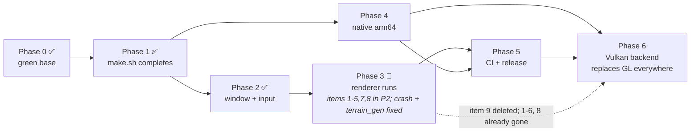

# macOS Port Plan

The plan: what the port is, the decisions behind it, the measured research it rests on, and the
phases with their gates.  The running status is in `PLAN.md` at the repo root; the evidence and the
verification recipes are in [progress.md](progress.md); every place implementation turned out to
differ from this document is in [deviations.md](deviations.md).

---
# macOS Port Plan

Status: **Phases 0, 1 and 2 landed; Phase 3 in progress** — PRs open on all three forks, CI for
Phase 0/1 green on all three platforms. Phase 3 is now **smaller** than originally planned: Phase 2
had to pull its minimum forward, the first Phase 3 session found and fixed a renderer crash, the
second found and fixed the renderer half of the gate (Deviations #24) and built the deterministic
scene the comparison needs (#25), and the third closed the `terrain_gen` half: the near-empty world
was **not** the voxel data source as #26 concluded, but a draw-buffer alias in the terrain
decoration render target that makes Apple's GL drop the draw (Deviations #27). `terrain_gen` renders
a coherent landscape on macOS. See [Next session](progress.md#next-session) to pick up, [Progress](progress.md#progress)
for branches, SHAs and evidence, and [Deviations](deviations.md#deviations-from-this-plan) for what
implementation turned out to differ from this document.

Goal: Bonsai builds and runs on macOS, alongside Windows and Linux.

---
## Decisions

| Decision | Choice | Rationale |
|---|---|---|
| Target arch (first) | x86_64 (Rosetta 2) | Verified working on M4 Max today: an x86_64 AppKit binary builds, creates an `NSOpenGLProfileVersion4_1Core` context and runs under Rosetta. Zero SIMD work to a running engine. Native arm64 follows as a bounded Phase 4. |
| Base | Fix-forward on new branch `port/macos` off `master` (`3813daac`) | Phase 0 also un-reds Linux, so CI gives real signal for everything after it. |
| Tooling | New cross-platform `.mise.toml`; Linux CI converted to mise; Windows keeps MinGW | One file, per-OS package and tool filters. Windows is the least-exercised path — leave it alone. |
| Long-term rendering API | Vulkan (Phase 6), MoltenVK on macOS | One API on all three platforms instead of permanent GL/Vulkan dual maintenance. Keeps SSBOs, compute and per-draw indexing, so it deletes Phase 3's GL 4.1 downgrade rather than living alongside it. |

Merges land to `master` per-phase, not as one mega-PR. Phase 0 and Phase 1 are independently
reviewable; Phase 3 is the mergeable-to-master milestone; Phase 4 is separate. Phases are developed
as **stacked PRs** — branch per phase, base = previous phase's branch — so each is reviewable and CI'd
on its own. Merge bottom-up.



Phase 6 (Vulkan) is a renderer rewrite rather than a platform port, and is deliberately larger than
Phases 0–5 combined. It is included here because it is the only item that changes the architecture
instead of adapting to it — but nothing before it depends on it.

Phase 0 spans **two repositories** and must land in order: `bonsai_stdlib` PR → its `master` →
bump the `external/bonsai_stdlib` gitlink in `bonsai` → CI goes green.

---

## Research findings
Measured on Apple M4 Max, macOS 26.5.2 (Darwin 25.5), Apple clang 21.0.0 (Xcode 26.5),
mise 2026.9.5. Line numbers are from `master` `3813daac` / `bonsai_stdlib` `e11fa2b`.

### Baseline is already broken, independent of macOS

CI run [`34768972202`](https://github.com/scallyw4g/bonsai/actions/runs/34768972202)
(run #535, 2026-09-13) on HEAD `3813daac`. Logs read from the failed-job transcripts:

| Job | Result | Failure |
|---|---|---|
| `build-ubuntu-22` | failure | `external/bonsai_stdlib/src/initialize.cpp:52:3: error: use of undeclared identifier 'PlatformPinCurrentThreadToCore'`; `:93:5: error: use of undeclared identifier 'PlatformInitializeAudio'; did you mean 'PlatformInitializeMutex'?` and the cascade `:93:29: error: cannot initialize a parameter of type 'mutex *' with an lvalue of type 'platform *'`. 3 errors per TU. |
| `build-and-release-windows` | failure | `examples/turn_based/game.cpp` `Input` undeclared at 12 sites (673, 685, 697, 709, 721, 733, 746, 812, 829, 887, 924, 960) **and** `examples/the_wanderer/game.cpp:66`. 13 errors total. |

Last green `master`: **2025-12-17** (run #530, `07f79e0e`), **5 runs ago** — runs #531–#535 are all
red. 75 commits have landed since. Both missing symbols are win32-only, so Linux has lacked posix
stubs since Dec 2025. Any macOS work sits on a red base.

### Two real blockers

**Blocker A — x86 intrinsics are pervasive (kills native arm64).**

```
external/bonsai_stdlib/bonsai_stdlib.h:23-26
  #if !BONSAI_EMCC
  #include <x86intrin.h>  #include <immintrin.h>  #include <smmintrin.h>
```

Measured:

```
$ clang++ -c t.cpp                              # arm64-apple-darwin25.5.0 (default)
  immintrin.h:14:2: error: "This header is only meant to be used on x86 and x64 architecture"
$ clang++ -c t.cpp -mssse3 -mavx -mavx2 -mfma
  error: unsupported option '-mssse3' for target 'arm64-apple-darwin25.5.0'   (and -mavx, -mavx2, -mfma)
```

Surface: **72 distinct `_mm*` intrinsics across 148 occurrences**. Helpers `simd_sse.h` (186 L),
`simd_avx2.h` (463 L), `avx2_v3.h` (192 L); direct use in `src/engine/mesh.h` (16 lines),
`src/engine/terrain.cpp` (17 lines), `external/bonsai_stdlib/src/{vector,thread,maff,debug_print}.h`.
`BONSAI_NO_AVX` drops `simd_avx2.h`, `avx2_v3.h` **and** `perlin.h`
(`bonsai_stdlib.h:31-34`, `:71-73`) — SSE stays mandatory. Direct `__rdtsc`: `perlin.cpp:500`,
`src/engine/terrain.cpp:144,250,380,454`, plus `GetCycleCount()` at
`linux_platform.h:118` (fn at `:115`), `win32_platform.h:99`, `wasm_platform.h:13`.

The Rosetta path works end-to-end today:

```
$ clang++ -mssse3 -mavx -mavx2 -mfma -target x86_64-apple-macos11 -o avxtest avxtest.cpp && ./avxtest
  avx ok 2.000000
$ clang++ -target x86_64-apple-macos11 -framework Cocoa -framework OpenGL -o xtest xtest.mm && ./xtest
  sizeof(NSUInteger)=8 / NSOpenGLPixelFormat ok      # AppKit + GL 4.1 context under Rosetta
$ ./page_arm  → _SC_PAGESIZE=16384
$ ./page_x86  → _SC_PAGESIZE=4096                   # Rosetta reports 4 KiB pages, not 16 KiB
$ clang++ ... -shared -fPIC -lGL                    # ld: library 'GL' not found
$ clang++ ... -shared -fPIC -framework Cocoa -framework OpenGL -framework IOKit   # ok, Mach-O dylib
$ ./rd → __builtin_arm_rsr64("cntvct_el0") compiles and runs on arm64
```

**Blocker B — macOS GL is 4.1 / GLSL 4.10; the renderer needs 4.3–4.6.**

Measured with a real `NSOpenGLProfileVersion4_1Core` core context:

```
GL_VERSION  : 4.1 Metal - 90.5
GL_RENDERER : Apple M4 Max
GLSL        : 4.10
MAX_TEXTURE_BUFFER_SIZE = 268435456
MAX_UNIFORM_BLOCK_SIZE  = 65536
glBindBuffer(GL_SHADER_STORAGE_BUFFER,…) → GL_INVALID_ENUM (0x500)
shader "#version 460/450/440/430/420 core" → FAILED (version not supported)
shader "#version 410 core"                 → COMPILED
shader "#version 330 core"                 → COMPILED
```

`gl.cpp` makes **132 `PlatformGetGlFunction` calls**; **130** of them are gated with
`Initialized &= fn != 0` (one gate is copy-pasted: `VertexAttribIPointer` is checked against
`VertexAttribPointer` at `gl.cpp:225-226`). **9 entry points are absent on macOS**, all confirmed
`absent` via `dlsym(RTLD_DEFAULT, …)` in a live 4.1 core context:

`glMultiDrawArraysIndirect` (`gl.cpp:129`) · `glBindTextures` (`:144`) · `glBufferStorage` (`:411`) ·
`glGetQueryBufferObject{iv,uiv,i64v,ui64v}` (`:475,478,481,484`) · `glGenerateTextureMipmap` (`:488`) ·
`glDebugMessageCallback` (`:429`)

→ `Ensure(InitializeOpenglFunctions())` (`initialize.cpp:71`) fails. The engine cannot start.

Only two of those are actually *called*: `glMultiDrawArraysIndirect` at `render.cpp:1746` (the hit
at `:1344` is commented out) and `glGenerateTextureMipmap` at `ui/ui.cpp:3580`. `glBindTextures`,
`glBufferStorage` and `glGetQueryBufferObject*` have zero call sites; `glDebugMessageCallback`'s
only call is commented at `gl.cpp:513`.

Measured substitutes:

| Needed | macOS substitute | Status |
|---|---|---|
| `glMultiDrawArraysIndirect` | loop of `glDrawArraysIndirect` (present) or `glMultiDrawArrays` (present) | ✅ |
| `glBindTextures` | `glActiveTexture` + `glBindTexture` (unused anyway) | ✅ |
| `glGenerateTextureMipmap` | `glActiveTexture` + `glBindTexture` + `glGenerateMipmap` (present) | ✅ |
| `glBufferStorage` | `glBufferData` (unused anyway) | ✅ |
| `glGetQueryBufferObject*` | unused → stop requiring | ✅ |
| `glDebugMessageCallback` | absent; unused, call commented at `gl.cpp:513` | ✅ |
| **SSBO** (`gBuffer.vertexshader:28`, `terrain/world_edit.fragmentshader:72`) | **TBO** — `glTexBuffer` present, `MAX_TEXTURE_BUFFER_SIZE = 268435456` | ✅ |
| `#version 460 core` | `410 core`, add `ShaderLanguageSetting_410core` | ✅ |

`gl_DrawID` at `shaders/gBuffer.vertexshader:53` is GLSL 4.60 (`ARB_shader_draw_parameters`) —
unavailable at 4.10 — it must become a per-draw index uniform. `MAX_UNIFORM_BLOCK_SIZE` is only
65536, which is why TBO beats UBO for the transform buffer.

Two extension-list traps, both measured:

- `GL_ARB_texture_buffer_object` is **not** in `glGetStringi(GL_EXTENSIONS)` (43 extensions
  total), but TBOs are core since GL 3.1 and `glTexBuffer` is present. Do not gate on the
  extension string.
- `GL_ARB_explicit_uniform_location` is absent, and `header.glsl:3` does
  `#extension GL_ARB_explicit_uniform_location : enable`. That is a **driver warning, not an
  error** — verified; no shader uses `layout(location=)` on a uniform.

#### Measured shader audit (replaces guesswork for Phase 3)

Reproducing the engine's exact preamble (`ValueFromSetting(…)` + `header.glsl` + raw shader file,
two-source `glShaderSource` as in `shader.cpp:26`) against the live 4.1 core context:

| Preamble | Compiled |
|---|---|
| `#version 460 core` | **0 / 56** |
| `#version 410 core` | **54 / 56** |
| `#version 330 core` | 54 / 56 |

The only two failures at 410 are the SSBO ones:

```
FAIL shaders/gBuffer.vertexshader            ERROR: 0:918: 'buffer' : syntax error
FAIL shaders/terrain/world_edit.fragmentshader ERROR: 0:962: 'buffer' : syntax error
```

56 = 47 `.fragmentshader` + 9 `.vertexshader`; plus `external/bonsai_stdlib/shaders/header.glsl`
= 57 files, none of which declares `#version` (the version is injected at runtime).

### What ports cleanly

Every POSIX/API the stdlib uses compiles on macOS: `mmap` + `MAP_NORESERVE`, `mprotect`, `sem_*`
(deprecated → warnings only; no `-Werror` anywhere), `clock_gettime(CLOCK_MONOTONIC)`,
`pthread_mutex_*`, `pthread_setschedparam`, `nanosleep`, `backtrace`, `ftw`, `arpa/inet.h` /
`sys/socket.h`, `dlopen`/`dlsym`.

`linux_file.cpp` (252 L) is portable as-is. `posix_platform.{h,cpp}` (195 + 330 L) need exactly
one edit for the Rosetta path (see Phase 2).

`bonsai_debug` needs no work — its only platform split is `#if BONSAI_WIN32` (ETW).

Engine threading already matches Cocoa's constraints:

| Work | Thread | Cocoa-safe |
|---|---|---|
| `OpenAndInitializeWindow` (`initialize.cpp:68`) | main | ✅ NSApp/NSWindow must be main |
| `ProcessOsMessages` (`api.cpp:458`, via `Bonsai_FrameEnd` at `:423`) | main | ✅ NSEvent pump |
| `PlatformMakeRenderContextCurrent` (`render_loop.cpp:925`) | render | ✅ `makeCurrentContext` + CGL lock |

Linker flags must diverge: `-lGL` fails hard (`library 'GL' not found`); use
`-framework Cocoa -framework OpenGL -framework IOKit`. `-shared -fPIC` correctly emits a Mach-O
dylib. `-lpthread` / `-ldl` both resolve.

### mise capability

- `[tools] clang` resolves via `conda:clang` / `asdf:mise-plugins/mise-llvm` /
  `vfox:mise-plugins/vfox-clang`; `18.1.1` … `23.1.1` available. Pin `18.1.8` (readme requires
  ≥ 18.1; `docs/01_build_process.md:6` still says 15 and is stale).
- **Per-OS filtering works on `[tools]` too**, not just `[bootstrap.packages]`: verified that
  `clang = { version = "18.1.8", os = ["linux"] }` is skipped on macOS. This is required — a bare
  `clang = "18.1.8"` would install LLVM on macOS and shadow Apple clang, contradicting the
  caveat below.
- `[bootstrap.packages]` supports per-OS filtering (`os = "linux"` / `"macos"` / list) and skips
  unavailable managers with a warning, so one cross-platform file works. `brew:` needs no
  Homebrew installed, on macOS or Linux.
- **Caveat:** on macOS the real toolchain dependency is Xcode Command Line Tools, which mise
  cannot install. Use system Apple clang on macOS; the mise clang pin is for Linux.
- **CI caveat:** runners have no mise. The workflow needs `jdx/mise-action` (or an equivalent
  install step) before `mise bootstrap … && mise install`.

---

## Phase 0 — green base

**DONE.** `bonsai` `b7ef48c7` / `bonsai_stdlib` `6b80224`, PRs `bonsai#1` + `stdlib#1`.

Prerequisite for macOS and fixes existing Linux/Windows CI.

### `external/bonsai_stdlib` (branch `port/macos`, PR to its `master`)

| Symbol | File | Change |
|---|---|---|
| `PlatformPinCurrentThreadToCore(u32)` | `src/platform/posix_platform.h` | inline no-op returning `False` (win32 twin at `win32_platform.cpp:168`) |
| `PlatformInitializeAudio(platform*)` | `src/platform/posix_platform.cpp` | stub → `Warn(...)`, `return False`, matching `struct audio { b32 Initialized; }` (`posix_platform.h:44`) |

Do **not** stub `PlatformShutdownAudio` / `PlatformPlaySoundBuffer`: they are referenced only from
win32 code and from inside `#if BONSAI_WIN32` in `src/engine/sound.h:163`. No posix TU needs them.

The stub must exist for Linux *and* macOS — both include `posix_platform.h`, so one declaration
covers both, and Linux CI goes green without macOS existing yet.

### `bonsai`

- `src/engine/engine_resources.h:183` — uncomment
  `input *Input = &Res->Stdlib.Plat.Input;` inside `UNPACK_DATA_RESOURCES`.
  This is the real Windows fix. `UNPACK_ENGINE_RESOURCES` is **already present** at
  `turn_based/game.cpp:650` and `the_wanderer/game.cpp:37`, which is why adding the macro cannot
  help; and `UNPACK_STDLIB` (`bonsai_stdlib.h:113-115`) only declares `Os`/`Plat`. Uncommenting
  fixes `turn_based` (12 sites) and `the_wanderer:66` (1 site) in one line.
  `blank_project` references `Input` only inside `#if 0` (`blank_project/game.cpp:94`), so it is
  unaffected either way.

### Gate

`gh run watch` on `port/macos` → **both `build-ubuntu-22` and `build-and-release-windows` green.**
First green CI since 2025-12-17; treat that as acceptance, not "compiles locally".

**MET** — [run `34856272505`](https://github.com/nsillik/bonsai/actions/runs/34856272505), both
jobs `success`.

Plan omissions, both implemented anyway:

- `src/engine/engine_resources.h` — the binding is at **`:182`**, not `:183`.
- The workflow's `pull_request.branches` was `["develop"]` only, so a PR against `master` (the
  default branch) started no jobs. Phase 0's gate is unobservable without fixing this. `master` was
  added here, then the filter removed entirely in Phase 1 (see Deviations #9).

---

## Phase 1 — `./make.sh` completes on macOS

**DONE** — gate exceeded. `bonsai` `922c1dcf` / `bonsai_stdlib` `82974dc`, PRs `bonsai#2` +
`stdlib#2`. CI [`34860403419`](https://github.com/nsillik/bonsai/actions/runs/34860403419): all three
jobs green. `RunTests` passes 10/10 on macOS and Linux — the plan expected it only to *run*.

Implemented as written in this section, with these corrections:

| Plan said | Reality |
|---|---|
| `$ARCH` introduced in `set_platform.sh`, normalized `arm64`/`x86_64` | Done, **and** `ARCH` is forced to `x86_64` when `Platform == macOS`, because Phase 1 always cross-targets. It is the *target* arch, not the host arch — anything reading `ARCH` must know that. |
| `PLATFORM_CXX_OPTIONS = "-g"` | Also needs `-x objective-c++`. See Deviations #2. |
| `PLATFORM_LINKER_OPTIONS` = the three frameworks | Also needs six `-Wl,-U,_Symbol` entries for the `link_weak` hooks. See Deviations #4. |
| Applies `-target x86_64-apple-macos11` | Done, guarded on `Platform == macOS && ARCH == x86_64`. |
| Platform dispatch: two edits in `platform.cpp` | Correct, and the split matters — the `posix_platform.cpp` guard at `:2` is separate from the per-OS ladder at `:8`. Both needed. |

Additional work not in this plan: `run_tests.sh`'s `.dSYM` glob (Deviations #7), the macOS platform
backend (Deviations #1), and `src/tests/allocation.cpp`'s Darwin `ucontext` field (below).

### `external/bonsai_stdlib/scripts/set_platform.sh`

Current file (9 lines): `UNAME=$(uname)` → `Platform=$UNAME` → `Linux`, or `Windows` for
`CYGWIN*|MINGW*|MSYS*`. Add:

```bash
elif [ "$UNAME" == "Darwin" ] ; then
  Platform="macOS"
```

Keep `Platform="macOS"` (not `Darwin`) so tarball naming reads `macOS_x86_64_release.tar.gz`
symmetrically with `Linux_x86_64_release.tar.gz`.

### `setup_for_cxx.sh` — new `elif [[ "$Platform" == "macOS" ]]` block

The Linux block is `:10-29`, Windows `:31-50`, and an unhandled platform hits
`echo "Unsupported Platform ($Platform), exiting." && exit 1`.

| var | value |
|---|---|
| `PLATFORM_LINKER_OPTIONS` | `-framework Cocoa -framework OpenGL -framework IOKit` |
| `PLATFORM_DEFINES` | `-D BONSAI_MACOS -D GL_SILENCE_DEPRECATION` |
| `PLATFORM_CXX_OPTIONS` | `-g` (`-ggdb` is accepted by Apple clang, so this is cosmetic) |
| `SHARED_LIBRARY_FLAGS` | `-shared -fPIC` |
| `PLATFORM_EXE_EXTENSION` | `""` |
| `PLATFORM_LIB_EXTENSION` | `.dylib` |
| `PLATFORM_INCLUDE_DIRS` | `-isysroot $(xcrun --show-sdk-path)` |

Do **not** carry `-lpthread -lX11 -ldl -lGL`.

`-mssse3 -mavx -mavx2 -mfma` live in the **shared** `CXX_OPTIONS` block (`:65`, flags at `:69-73`),
not in the per-platform blocks — so they are not platform-filterable as written. On an arm64 host
they hard-error unless a `-target x86_64-apple-macos*` is supplied, which is why the target flag is
required in Phase 1 and must be paired with an arch-conditional in Phase 4.

### `make.sh`

- `SetBuildAllFlags` (`:391`): enable `BuildDebugOnlyTests` for macOS as well as Linux (Linux-only
  today at `:399-401`).
- `BundleRelease` tar (`:502-534`): the `x86_64` literal is hardcoded three times (`:529`, `:531`,
  `:533`). **`$ARCH` does not exist anywhere in the repo** — Phase 1 must introduce it (e.g.
  `ARCH=$(uname -m)` in `set_platform.sh`, normalised to `arm64`/`x86_64`) and interpolate it.
- Applies `-target x86_64-apple-macos11` only when `$Platform == macOS` and `$ARCH == x86_64`.
  There is no `-target` or `-march` anywhere in the build scripts today.

### Platform dispatch

Two edits, not one. `platform.cpp` needs the arm at `:2` **and** in the ladder at `:8`:

```c
#if BONSAI_LINUX || BONSAI_MACOS || BONSAI_EMCC
#include <bonsai_stdlib/src/platform/posix_platform.cpp>
#endif

#if BONSAI_WIN32
#include <bonsai_stdlib/src/platform/win32/win32_platform.cpp>
#elif BONSAI_LINUX
#include <bonsai_stdlib/src/platform/linux/linux_platform.cpp>
#elif BONSAI_MACOS
#include <bonsai_stdlib/src/platform/macos/macos_platform.cpp>
#elif BONSAI_EMCC
#include <bonsai_stdlib/src/platform/wasm_platform.cpp>
#include <bonsai_stdlib/src/platform/linux/linux_file.cpp>
#else
#error "Unsupported Platform"
#endif
```

`platform.h:29-38`:

```c
#elif BONSAI_MACOS
#include <bonsai_stdlib/src/platform/posix_platform.h>
#include <bonsai_stdlib/src/platform/macos/macos_platform.h>
```

### `.mise.toml` (new, repo root)

```toml
[tools]
clang = { version = "18.1.8", os = ["linux"] }

[bootstrap.packages]
"apt:libx11-dev"    = { os = "linux" }
"apt:freeglut3-dev" = { os = "linux" }

[tasks.build]
run = "./make.sh"
[tasks.test]
run = "./make.sh RunTests"
```

macOS declares no bootstrap packages: Cocoa/OpenGL/IOKit come from the SDK, and the one true
prerequisite (`xcode-select --install`) is not mise-installable. Document it in
`docs/01_build_process.md` with a `mise doctor` note.

### CI — `.github/workflows/build.yml`

Ubuntu job: replace `- run: sudo apt update && sudo apt install freeglut3-dev libx11-dev clang`
with

```yaml
- uses: jdx/mise-action@v3
- run: mise bootstrap packages apply --yes && mise install
- run: ./make.sh && ./make.sh RunTests
```

This also upgrades Linux from the distro's clang-14 to the pinned 18.1.8, matching `readme.md:40`.

New `build-macos` job. **The `macos-*` runners are arm64 and do not ship Rosetta 2**, so the
x86_64 binaries this job builds cannot be *run* without explicitly installing it:

```yaml
  build-macos:
    runs-on: macos-latest
    steps:
    - uses: actions/checkout@v3
    - name: Checkout submodules
      run: git submodule update --init --recursive
    - name: Install Rosetta
      run: sudo softwareupdate --install-rosetta --agree-to-license
    - uses: jdx/mise-action@v3
    - run: ./make.sh && ./make.sh RunTests
```

### Gate

`./make.sh` exits 0 locally and on `macos-latest`; `./make.sh RunTests` runs (individual test
failures are Phase 2).

**MET, exceeded** — `./make.sh` exits 0 locally and on `macos-latest`; `RunTests` exits 0 with 10/10
suites passing on macOS *and* Linux. Test failures were not deferred.

Two implementation notes:

- The CI YAML above is written as one `run:` step joining build and test. Implemented as two
  separate steps (`Build`, `Test`) so a failure names which one broke.
- Linux needed the pinned clang for a second reason the plan did not anticipate: the distro's
  clang-14 **cannot compile the tree at all**. It fails in `avx512bwintrin.h` with 2001 errors
  (`use of undeclared identifier '__builtin_ia32_selectw_512'`) before reaching any project code.
  The mise pin is load-bearing, not just a version-tidiness change.

`src/tests/allocation.cpp` also needed a fix to build at all with `BuildDebugOnlyTests` enabled on
macOS: the SIGSEGV handler advances the saved PC, which is `uc->uc_mcontext.gregs[REG_RIP]` on Linux
but `uc->uc_mcontext->__ss.__rip` on Darwin (`uc_mcontext` is a *pointer* there). arm64 spells it
`__ss.__pc`; left to Phase 4 with a TODO.

---

## Phase 2 — window opens, tests pass

**DONE.** `bonsai` `11e2502f`, `bonsai_stdlib` `a7d2dd3`, `bonsai_debug` `b6ceecb`. All six items
implemented; the gate is met. See [Progress → Phase 2](#phase-2--window-opens-tests-pass-done) for the
evidence and the two things deliberately left unverified.

Item-by-item, the six under *Remaining*:

1. **Key mapping** — done, verified key by key against `offsetof()` on the real `input` struct.
2. **Mouse buttons** — done, LMB/RMB/MMB all verified. This also surfaced that
   `setAcceptsMouseMovedEvents:` was never set, so mouse *move* only worked while a button was held.
3. **`scrollWheel` → `MouseWheelDelta`** — done. `scrollingDeltaY`, accumulated rather than assigned,
   and scaled by 120 only when `hasPreciseScrollingDeltas` is false so a wheel notch matches the 120
   Linux and win32 report.
4. **Retina assertion** — done, in `UpdateScreenDimFromBacking`, which is now the single place
   `ScreenDim` is derived and the one the resize callbacks call.
5. **Live resize** — done, via `windowDidResize`/`windowDidChangeBackingProperties` on the delegate.
   This needed a change the plan did not anticipate: the CGL lock had to stop spanning the render
   thread's lifetime, because `[ctx update]` takes the same lock and may only run on the main thread.
   See Deviations #13.
6. **Gate** — `./bin/game_loader` opens a window, renders terrain and UI, hot-reloads its `.dylib`
   list, and exits 0. Visually confirmed; not inferred from the exit code.

For the record, the plan's re-scopings held: `ErrnoToString` was not ported (Deviations #5) and the
`SetVSync` macOS branch was not needed (Deviations #6).

### What Phase 2 pulled forward from Phase 3

Nine of Phase 3's items, because the window cannot exist without them (Deviations #13). Do not redo:
items 1 (410core), 2, 5, 6 (SSBO→TBO in both shaders), 3 and 4 (`gl_DrawID`→uniform + indirect loop),
7 (entry-point gating) and 8 (mipmap fallback).

### What Phase 2 did not verify

- The **world-edit path** is converted to TBO but has never executed a brush against terrain. It needs
  a working `.brush` asset, and the assets on `master` are stale (Deviations #18), so this is blocked
  on regenerating them rather than on the port.
- `terrain_gen` and `blank_project` have not been launched at all. That is Phase 3's gate.

### Reference: the original Phase 2 specification

`external/bonsai_stdlib/src/platform/macos/macos_platform.{h,cpp}` **exists** (158 L + 327 L) and
already provides everything this section originally asked for, because Phase 1 could not link
without it (Deviations #1). Implemented:

- `os { window Window; display Display; gl_context GlContext; b32 ContinueRunning }` with
  `window`/`display`/`gl_context` typedefs — but as `NSWindow*`/`NSView*`/`NSOpenGLContext*`
  pointers, not opaque handles
- `GetCycleCount()` via `__rdtsc` (arm64 path is Phase 4)
- `PlatformGetGlFunction` via `dlsym(RTLD_DEFAULT, …)`
- `PlatformStdoutIsRedirected`, `PlatformDebugStacktrace`, `PlatformCreateDir`,
  `PlatformDeleteDir`, `OpenLibrary`/`CloseLibrary`/`GetProcFromLib`
  (`_chdir`, `PlatformChangeDirectory`, `PlatformInitializeStdout` decl)
- `PLATFORM_RUNTIME_LIB_EXTENSION ".dylib"`
- `OpenAndInitializeWindow` — `NSOpenGLProfileVersion4_1Core` pixel format, context, view,
  `Terminate`, `ProcessOsMessages` (NSEvent pump), `BonsaiSwapBuffers` (under `CGLLockContext`),
  `PlatformMake`/`ReleaseRenderContextCurrent`, `PlatformInitializeStdout`,
  `PlatformGetEnvironmentVar`, `Platform_EnableContextSwitchTracing`, `ConnectToServer`
  (under `#if BONSAI_NETWORK_IMPLEMENTATION`)

Two deliberate re-scopings, both argued in Deviations:

- **`ErrnoToString` is not ported and should be dropped from this section's list.** It has zero
  callers, and macOS defines only 85 of the 122 `errno` constants the Linux version switches over,
  so a copy would silently drop 37 cases. Use `strerror(3)` if ever needed. (Deviations #5)
- **The `SetVSync` macOS branch in `gl.cpp` is not needed.** `SetVSync` is still never called. The
  swap interval is set in `OpenAndInitializeWindow` via `NSOpenGLCPSwapInterval`, where the context
  is created. Only revisit if `SetVSync` is wired up for both platforms. (Deviations #6)

### Remaining — this is what Phase 2 actually is

1. **Key mapping.** `ProcessOsMessages` `NSEventTypeKeyDown`/`KeyUp` has a TODO. `keyCode` is
   physical and layout-independent, so it maps to `src/engine/input.h`'s 63 fields as a flat table —
   the shape of the two X11 keysym switches at `linux_platform.cpp:182-300`. **Requires interactive
   verification**; a table that compiles proves nothing.
2. **Mouse buttons.** Same handler, `NSEventTypeLeftMouseDown`/`Up`/`Right`/`Other` and drags have a
   TODO. Mouse *position* is already wired (point→backing conversion, Y flipped).
3. **`scrollWheel` → `MouseWheelDelta`.** TODO in place.
4. **Retina assertion.** `ScreenDim` is currently derived from `convertRectToBacking`, which is
   right, but there is no assertion. Add `Assert(ScreenDim == backing-scaled window size)` at init,
   per the Risks table.
5. **Live resize must not block the render thread.** `windowWillStartLiveResize`/
   `windowDidResize` are not handled; `[ctx update]` on bounds change is not called. The delegate
   (`BonsaiWindowDelegate`) currently only handles `windowWillClose`, so there is a place to put
   these.
6. **Gate:** `./bin/game_loader` opens a window, hot-reloads a `.dylib`, and exits cleanly —
   **visual confirmation, not just exit code.** This is the first phase where a window is expected
   to appear; nothing before it has opened one.

### Reference: the original Phase 2 specification

Kept for the parts not yet done. Thread mapping was verified correct and needs no engine change —
main thread does `OpenAndInitializeWindow` (`initialize.cpp:68`) and the NSEvent pump
(`api.cpp:458`); the render thread owns GL (`render_loop.cpp:925`).

Original budget — ✅ marks what Phase 1 already delivered:

- ✅ `NSOpenGLProfileVersion4_1Core` pixel format + `NSOpenGLContext`, all GL under
  `CGLLockContext`/`CGLUnlockContext`
- ⚠️ **Retina**: `Plat->ScreenDim` deriving from `convertRectToBacking:` is **done**; the
  `SetViewport` reconciliation assertion is **not** (remaining item 4)
- ❌ `[ctx update]` on bounds change; live resize must not block the render thread (remaining item 5)
  `activateIgnoringOtherApps:` — without this the window gets no focus and no menubar
- ❌ keyCode → `input` table for the 63 fields in `input.h:11-88` (physical and layout-independent,
  so a flat table like the two X11 keysym switches at `linux_platform.cpp:182-300`) —
  remaining item 1
- ⚠️ mouse: Y-flip and backing-scale **done**; buttons and `scrollWheel` → `MouseWheelDelta` not
  (remaining items 2, 3)
- ✅ vsync: `[ctx setValues:&n forParameter:NSOpenGLCPSwapInterval]`

### `posix_platform.cpp` — the Rosetta-path edit

**DONE in Phase 1.** `sched_setscheduler(0, SCHED_FIFO, …)` is now
`pthread_setschedparam(pthread_self(), SCHED_FIFO, …)` under `#if BONSAI_MACOS`. The Linux branch is
byte-identical to before. Two notes: `pthread_setschedparam` returns its error code rather than
setting `errno`, and the branch reports with `Warn` not `Error` because `SCHED_FIFO` requires root on
macOS. The only callers remain inside `#if 0`.

`PlatformCreateThread` also needed a fix in the same file: `u32(Thread)` truncates a pointer
`pthread_t` on macOS. Now casts through `umm`. (Deviations #8 — this one broke Linux CI.)

**No page-size edit here.** Rosetta reports `_SC_PAGESIZE == 4096` for x86_64 processes (measured),
so `Assert(PageSize == 4096)` at `posix_platform.cpp:66` passes. That patch belongs to Phase 4.

`linux_file.cpp` is reused directly.

### Gate

`./make.sh RunTests` → all suites pass (**already true** as of Phase 1). `./bin/game_loader` opens a
window, hot-reloads a `.dylib`, and exits cleanly — **visual confirmation, not just exit code**.

The window half is unmet: no window has been opened yet. This is the first phase where pixels or a
window are expected; Phase 1 verified only that the build links and the suites pass.

---

## Phase 3 — renderer runs: **in progress**

**MOSTLY LANDED IN PHASE 2.** Items 1, 2, 3, 4, 5, 7 and 8 are done — they had to be, because the
window cannot open on a 4.1 core context without them (Deviations #13). Item 9 is decided
(Deviations #19). What the first Phase 3 session added is below; item 6 and the gate are still open.

### Already landed in Phase 2

| # | Change | Where it landed |
|---|---|---|
| 1 | `ShaderLanguageSetting_410core` + `DefaultShaderLanguage()` | `shader.{h,cpp}`; `settings.init`'s dead `430core` line removed |
| 2 | `composite` + `world_edit` shaders compile at 410 | plus the 6 empty-case fixes (Deviations #14) |
| 3 | `gl_DrawID` → `DrawIndex` uniform | `gBuffer.vertexshader` |
| 4 | `glMultiDrawArraysIndirect` → per-draw loop (Phase 2; now direct `glDrawArrays`, Deviations #21) | `render.cpp` `MultiDrawIndirect` |
| 5 | Transform SSBO → TBO | `gBuffer.vertexshader`, `MultiDrawIndirect` |
| 6 | Edit-op SSBO → TBO | `world_edit.fragmentshader`, `render_loop.cpp` — **converted, not yet exercised** |
| 7 | Stop requiring absent entry points; fix two copy-pasted gates | `gl.cpp`, `gl.h` |
| 8 | `glGenerateTextureMipmap` → `glGenerateMipmap` | `ui/ui.cpp` |

Item 3+4 landed together, as the plan required: the uniform is what replaces `gl_DrawID`, so the loop
is what feeds it. Note the loop is **not** a macOS-only fallback — it runs on every platform, because
the shader no longer has `gl_DrawID` for a single call to read. Phase 6 gets the single call back
under Vulkan, where `gl_DrawIndex` is 1:1.

## Phase 4 — native arm64

Independent of Phase 3. Behind `#if defined(__aarch64__)`, in `bonsai_stdlib`:

- New `simd_neon.h`; `simd_sse.h`'s 4-wide float ops map ~1:1 to `float32x4_t`
- `simd_avx2.h` / `avx2_v3.h` 8-wide: 2× `float32x4_t`, scalar fallback where lane-crossing
  semantics get awkward (`_mm256_permutevar8x32_ps`, `terrain.cpp:1211`)
- `src/engine/mesh.h` (16 lines, `_mm_set_ps`/`_mm_mul_ps` on `v4`) — mechanical
- `src/engine/terrain.cpp` (17 lines, 9 live / 8 commented), `vector.h`, `thread.h`, `maff.h`,
  `debug_print.h` — small
- `__rdtsc` → `cntvct_el0`; `GetCycleCount()` arm64 branch (`linux_platform.h:115-120`)
- Gate the `x86intrin.h`/`immintrin.h`/`smmintrin.h` includes at `bonsai_stdlib.h:24-26`
- `#if BONSAI_MACOS` in `setup_for_cxx.sh`: drop `-target x86_64-apple-macos11` **and** drop
  `-mssse3 -mavx -mavx2 -mfma` from the shared `CXX_OPTIONS` block (`:69-73`) — leaving those in
  place hard-errors on `arm64-apple-darwin`
- Relax the page-size assert in `posix_platform.cpp:63-67` from `4096` to `4096 || 16384`
  (Apple Silicon reports 16384; Rosetta reports 4096, so this is arm64-only)

### Gate

`macos-latest` (arm64) builds and `RunTests` passes natively, with no Rosetta install step. Keep
the Rosetta job until arm64 has survived a full release cycle.

---

## Phase 5 — release & docs

- `BundleRelease` arch naming (`macOS_arm64` vs `macOS_x86_64`)
- `readme.md:46` ("as long as your platform of choice is Windows or Linux ;)") and
  `readme.md:43` (Quickstart)
- `docs/00_getting_started.md:7` ("Windows and Linux are supported.")
- `docs/01_build_process.md`: clang version (`:6` says clang-15; readme says ≥ 18.1); mise
  bootstrap; new macOS section with `xcode-select --install`
- Retire `default.nix` (X11/Mesa-only, no Darwin support) in favour of `.mise.toml`

---

## Phase 6 — Vulkan backend (replaces GL on all three platforms)

Deferred until Phases 0–5 land. Unlike every other phase, this one does not adapt the renderer to a
new platform — it replaces the renderer's API. Expect it to dwarf Phases 0–5 combined.

Goal: one graphics API on macOS, Linux, and Windows. On macOS that means Vulkan-over-Metal, which
retires every compromise Phase 3 makes — SSBOs, compute and per-draw indexing are all native.

### Driver reality

| Implementation | Arch | Vulkan | Status |
|---|---|---|---|
| **MoltenVK** (Khronos) | x86_64 + arm64 | README says **1.4**; LunarG's SDK page still says 1.3 | Current default ICD in the Vulkan SDK |
| **KosmicKrisp** (LunarG) | **arm64 only** | 1.3 conformance | Alpha / technical preview; needs Metal 4 + macOS 26+ |

LunarG's own documentation states MoltenVK "is not actively developed or supported by LunarG", and
that "the default Vulkan Implementation installed by the Vulkan SDK will be KosmicKrisp" —
which "is only functional on Apple Silicon, not `x86_64`".

→ **Phase 6 depends on Phase 4, not Phase 2.** Vulkan on the Rosetta x86_64 path is possible
(MoltenVK supports it), but the successor driver is arm64-only, so that is the least future-proof
combination available. Do not spend a renderer rewrite on an architecture the driver vendor is
moving away from.

→ Probe at runtime; never hardcode a version or assume extensions.
`VK_KHR_portability_enumeration` is **required** by MoltenVK and *neither needed nor supported* by
KosmicKrisp. The two drivers disagree, so the code must branch on what it finds.

### Tooling

Vulkan SDK (LunarG) for validation layers, `glslang`/`glslc` and SPIR-V tools; **Volk** as loader
and **VMA** for allocation (both optional SDK components). Homebrew equivalents if a slimmer install
is preferred: `molten-vk` 1.4.2, `vulkan-loader` 1.4.357.0, `shaderc` 2026.4, `glslang` 16.6.0,
`spirv-tools` 1.4.357.0.

### Measured work surface

**413 GL call sites** outside the loader, across 19 files — but 8 files hold **367 of them
(88.9%)**:

| File | Sites |
|---|---|
| `src/engine/render.cpp` | 128 |
| `external/bonsai_stdlib/src/gpu_mapped_buffer.cpp` | 70 |
| `external/bonsai_stdlib/src/shader.cpp` | 56 |
| `external/bonsai_stdlib/src/ui/ui.cpp` | 37 |
| `external/bonsai_stdlib/src/texture.cpp` | 26 |
| `src/engine/render_loop.cpp` | 19 |
| `src/engine/render/render_init.cpp` | 18 |
| `external/bonsai_stdlib/src/2d_render_utils.cpp` | 13 |

By work type:

| Work | Sites | Where |
|---|---|---|
| Pipeline state (depth / blend / cull / viewport) | 91 | `render.cpp` 53 |
| VAO + vertex attributes | 74 | `gpu_mapped_buffer.cpp` 34, `render.cpp` 25 |
| Framebuffer / render target | 63 | `render.cpp` 24, `render_init.cpp` 10 |
| Texture create / bind / params | 60 | `texture.cpp` 26, `ui.cpp` 11 |
| Shader / program objects | 31 | `shader.cpp` 23 |
| Uniform binding | 28 | `shader.cpp` 23 |
| Sync / queries (GPU timers) | 25 | `render_loop.cpp` 13, `gpu_timer.h` 6 |
| Buffer mapping (persistent streaming) | 19 | `gpu_mapped_buffer.cpp` 17 |
| Buffer upload | 17 | `gpu_mapped_buffer.cpp` 8 |
| Draw calls | **5** | `render.cpp` 4 |

The draw-call count is the good news: five sites drive the whole renderer.

### Two hard portability blockers

**1. `v3_u8` is a 3-byte vertex with a 3-byte stride.** `vector.h:37-43` declares
`union v3_u8 { u8 E[3]; struct { u8 x, y, z; }; struct { u8 r, g, b; }; }` with
`CAssert(sizeof(v3_u8) == 3)`, and `gpu_mapped_buffer.cpp:454` binds it with GL `stride = 0` —
tightly packed, so the effective stride is 3. MoltenVK requires every vertex binding stride to be a
**multiple of 4 bytes**, and does not support `vertexAttributeAccessBeyondStride`. It must be padded
to 4.

This is the primary voxel-chunk vertex format, not a corner case: it backs `AllocateMesh(...,
DataType_v3_u8, ...)` at `api.cpp:806` and `voxel_loader` at `loaders/vox.cpp:557`, the GPU mesh
heap (`gpu_heap_allocator.cpp:48,55,70-73` assert and size on it), and the greedy/naive/mip chunk
mesh builders in `world_chunk.cpp:3276-3311`.

#### Spike 6.0b — is padding a win, or only a cost?

The padding is **required for Vulkan but unproven as an improvement on GL**. Both variants are
expressible in GL (stride 3 and stride 4 are both legal), so the GL path is where the question can
be answered cleanly, before any Vulkan code exists. Run this at the **end of Phase 3**, when
`terrain_gen` renders and frame time is measurable — not at the start of Phase 6.

**Blast radius — corrected.** An earlier draft of this plan claimed a format-version bump was
needed. That was wrong: mesh serialization is entirely stubbed (`asset.cpp:107 SerializeMeshData` is
`NotImplemented` behind `#if 0`, `SerializeMesh`/`DeserializeMesh` have zero callers, and the
`world_chunk_file_header_*` constructors record `sizeof(v3)`, not `v3_u8`). There is **no on-disk
format to migrate**; chunk meshes are regenerated at runtime from voxels.

The real couplings are arithmetic, not files:

| Site | What changes |
|---|---|
| `gpu_heap_allocator.cpp:56,70,73` | `GpuHeapCapacityBytes` and `InitGpuHeap` both divide/multiply by `sizeof(v3_u8)`; the heap's capacity is expressed **in elements**, so a fixed byte budget buys 25% fewer |
| `mesh.cpp:21-22` | CPU-side `allocate_proc(v3_u8, …)` for `Verts`/`Normals` |
| `mesh.h:206-207`, `:236-237` | `CopyMemory(… Count*sizeof(v3_u8))` |
| `gpu_mapped_buffer.cpp:162,333` | buffer size and `MapBufferRange` extent |
| `render.cpp:2054-2057` | `BaseOffsetInElements * sizeof(v3_u8)` → GPU sub-allocation offsets |
| `mesh.h:65` `DataTypeToElementSize[]` | element size table (currently `3`) |
| `voxel_face.h:45-50` | static `v3_u8` face-normal literals `{{127,0,0}}` — union aggregate init still compiles, so low risk |

**The cost is precise:** position and normal are separate buffers, so per vertex it is
`3 + 3 + 4 = 10` bytes today against `4 + 4 + 4 = 12` padded — **+20% total, +33% on the vertex
buffers**. Against that, `RequestedHeapSizeInBytes / sizeof(v3_u8)` currently discards up to 2 bytes
of every heap request, which padding removes.

**The suspected win is unverified:** 3-byte vertex fetch forces unaligned 32-bit loads, which GL
drivers emulate and some may fall back on. Whether that costs measurable frame time on this
renderer is exactly what the spike must establish — not assume.

**Candidate approaches** (pick during the spike, do not pre-commit):

1. Pad `v3_u8` itself to 4 bytes. Smallest diff, but `v3_u8` doubles as a **colour type**
   (`union { r, g, b }`, used by `colors.h:485` and `quaternion.h:122 Rotate`), so it resizes a
   shared general-purpose type to serve one GPU path.
2. Introduce a dedicated 4-byte vertex type for the vertex path only, leaving `v3_u8` alone.
   Cleaner separation; touches every `Cast(v3_u8*, …)` pointer-walk in `mesh.h` and
   `world_chunk.cpp`.
3. Keep 3-byte storage but give the GPU buffer a padded stride. Rejected on inspection: all the
   `Cast(v3_u8*, Base) + Offset` arithmetic assumes `stride == sizeof(v3_u8)`, so a divergent GPU
   stride would silently corrupt every mesh-walk. Recorded so it is not re-proposed.

**Decision criteria.** Compare, on the same `terrain_gen` scene at 1920×1080: frame time, and mesh
heap bytes per unit of world. Pad if the alignment win is measurable; if it is neutral, still pad —
Vulkan requires it — but choose approach 2 over approach 1 to avoid resizing the colour type, and
budget the +20% vertex memory explicitly rather than treating it as free.

Whichever way it goes, this is a change to a hot data structure, so gate it on visual parity of
`terrain_gen` output plus `./make.sh RunTests`.

**Also validate rather than assume:** the `matl` buffer (`gpu_mapped_buffer.cpp:469-470`) uses
`stride = sizeof(matl) = 4` with `TransEmiss` = 2 bytes at offset 2, so the attribute ends *exactly*
on the stride boundary. The stride satisfies the multiple-of-4 rule; the exact-fit attribute is the
kind of layout MoltenVK validates strictly, so confirm it empirically during 6.0b.

**2. Portability enumeration is mandatory on MoltenVK.** Without
`VK_INSTANCE_CREATE_ENUMERATE_PORTABILITY_BIT_KHR` plus the `VK_KHR_portability_enumeration` and
`VK_KHR_get_physical_device_properties2` instance extensions, `vkEnumeratePhysicalDevices` returns
an empty list or `VK_INCOMPLETE`. A device reporting `VK_KHR_portability_subset` also requires that
extension enabled at device creation.

Because KosmicKrisp neither needs nor supports it, enable it conditionally after probing — not
unconditionally for all Apple builds.

### What Vulkan buys back

The whole GLSL downgrade from Phase 3 is deleted:

| Phase 3 work | Under Vulkan |
|---|---|
| Items 2, 5, 6 — SSBO → TBO | Native storage buffers; `layout(std430, binding=)` works unchanged |
| Items 3, 4 — `gl_DrawID` → per-draw uniform | `gl_DrawIndex` via `VK_KHR_shader_draw_parameters` — **1:1 with the existing `gl_DrawID`**, no engine change. Phase 3 additionally stopped drawing the commands indirectly (Deviations #21); `vkCmdDrawIndirectCount` is the native replacement for what that loop was standing in for |
| Item 1 — `ShaderLanguageSetting_410core` | `#version 460` is correct on Vulkan; no downgrade needed |
| Items 7, 8 — entry-point gating, mipmap fallback | The GL loader is replaced wholesale |
| Item 9 — `SetVSync` | `VK_PRESENT_MODE_FIFO_KHR`. Phase 3 left it untouched rather than wiring it up (Deviations #19) |

Per MoltenVK's advertised extension list, supported and relevant here:
`VK_KHR_dynamic_rendering` (so the 63 framebuffer sites need no `VkRenderPass`/`VkFramebuffer`
objects), `VK_KHR_draw_indirect_count`, `VK_KHR_shader_draw_parameters`, `VK_KHR_push_descriptor`
(which maps onto the 28 "bind uniform, then draw" sites without descriptor-pool churn),
`VK_KHR_portability_subset`, `VK_KHR_maintenance{1..9}`. Timestamp queries are supported; only
`VK_QUERY_TYPE_PIPELINE_STATISTICS` is not — and `gpu_timer.h` uses `GL_TIME_ELAPSED`, a timestamp
query, so it maps cleanly to `VK_QUERY_TYPE_TIMESTAMP`.

### Sub-phases

| # | Work | Notes |
|---|---|---|
| 6.0 | **Spike:** port only the 2D UI renderer — `ui/ui.cpp` + `2d_render_utils.cpp` + `framebuffer.cpp`, ~150 sites | Self-contained: no indirect draw, no SSBO. Yields a real velocity number for the rest instead of an estimate |
| 6.0b | **Spike:** vertex-format stride padding (`v3_u8` 3 → 4 bytes). See "Blocker 1" above for the full spec, couplings and decision criteria | Must complete before 6.2, but can be run at the end of **Phase 3** — both strides are legal in GL, so the question is answerable as soon as `terrain_gen` renders |
| 6.1 | Instance / device / swapchain / frames-in-flight | 2–3 swapchain images; Metal supports a maximum of 3 and may hold them at present time |
| 6.2 | Resource layer: buffers, images, samplers, descriptors, pipelines; VMA allocation | Replaces `texture.cpp`, `framebuffer.cpp`, and the `struct opengl` seam |
| 6.3 | Port `gpu_mapped_buffer.cpp` streaming geometry | The crux: N frames in flight, per-frame buffer regions, explicit fences/semaphores instead of implicit GL sync |
| 6.4 | Port `render.cpp` + `render_loop.cpp` + `render_init.cpp` | Dynamic rendering replaces FBO binding; `vkCmdDrawIndirectCount` replaces the multi-draw |
| 6.5 | Shader pipeline: GLSL → SPIR-V at build time | 242 `uniform ` declarations need explicit `layout(set=, binding=)`. `header.glsl` (889 L) survives — it is `#define`s and helper functions, not uniforms |
| 6.6 | GPU timers → `VK_QUERY_TYPE_TIMESTAMP` | `gpu_timer.h` maps directly |
| 6.7 | Retire the GL backend | Only after Vulkan is green on all three platforms |

**Shader hot-reload is a design decision, not a port.** Under GL the engine reads `.glsl` from disk
and compiles at runtime (`shader.cpp:150-204`). Under Vulkan that becomes GLSL → SPIR-V (link
`glslang`, or shell out to `glslc`) → MSL (MoltenVK, inside `vkCreateShaderModule`). Either keep it
by embedding `glslang`, or drop hot-reload on the Vulkan path. MoltenVK's pipeline cache can
serialize the converted MSL offline so the SPIR-V→MSL step is not repeated at startup.

### Relationship to Phase 3

Phase 3 is a **deliberate bridge**: two shader files plus entry-point gating, in exchange for a
working macOS renderer months earlier. Phase 6 then deletes Phase 3 items 1–6, 8 and 9.

If Phase 6 is committed to before Phase 3 starts, Phase 3 can be cut to item 7 alone — the minimum
needed to get pixels on screen — and the GLSL downgrade skipped entirely. Recorded here so that is a
decision rather than an accident.

One item Phase 6 *adds* to Phase 3 rather than deletes: **spike 6.0b**, vertex-format stride padding.
It is orthogonal to the GL 4.1 work and to Vulkan — both strides are legal in GL — and it is listed
as optional in Phase 3's gate because Phase 3 is simply the first point at which a renderer exists
to measure against. It informs 6.2's vertex input design, so it must resolve before then.

### Gate

`terrain_gen` and `blank_project` render, visually matching the GL path. One full run with the
Khronos validation layers enabled and **zero errors**. Confirm the Phase 3 GLSL-410 downgrade and
the TBO conversion are deleted, not merely bypassed. Benchmark against the GL path on the same
scene (`terrain_gen`, 1920×1080) — Vulkan-over-Metal on Apple Silicon should not be slower than the
GL 4.1 shim it replaces.

---

## Risks

| Risk | Mitigation |
|---|---|
| Rosetta 2 is a shrinking surface (Apple signalled reduced functionality in future macOS) | Phase 4 is the permanent answer; Rosetta is explicitly interim |
| Rosetta 2 is absent on CI macOS runners, so cross-built binaries cannot run | Explicit `softwareupdate --install-rosetta --agree-to-license` step in `build-macos` |
| `master` has 9 months of unreviewed drift; CI was red for all of it | First-green CI is the Phase 0 gate, before any macOS code lands |
| Phase 0 spans two repos; the `bonsai` side is inert until the stdlib PR merges and the gitlink is bumped | Sequence explicitly: stdlib PR → stdlib `master` → `git submodule update` + commit the new SHA |
| Retina backing scale silently halves render resolution while looking correct | Assert `ScreenDim == backing-scaled window size` at init |
| Live resize blocking the main thread starves the render thread | Handle `windowWillStartLiveResize`/`windowDidResize` explicitly instead of relying on the poll loop |
| `ShaderLanguageSetting_410core` forces a GLSL downgrade on Linux/Windows too | Keep 460 as the default off macOS; only macOS selects 410. Measured: 54/56 shaders are 410-clean today, so the blast radius is the 2 SSBO files |
| A bare `clang = "18.1.8"` in `.mise.toml` would install LLVM on macOS and shadow Apple clang | `os = ["linux"]` filter on the tool entry (verified honoured) |
| mise-installed LLVM on macOS needing `-isysroot` | Use system Apple clang on macOS; the mise clang pin is for Linux |
| Descriptor-binding model changes (SSBO → TBO) silently drop the transform/edit-op data | Gate is visual comparison of `terrain_gen` output against Linux, not just "it launched" |
| Vulkan on macOS has a moving driver target: MoltenVK is described by LunarG as no longer actively developed, and its stated successor (KosmicKrisp) is arm64-only and still alpha | Land Phase 6 on Phase 4's arm64 base; probe capabilities at runtime instead of hardcoding extensions; keep the GL path until Vulkan is green on all three platforms |
| Padding `v3_u8` to a 4-byte stride costs ~20% more vertex memory (10 → 12 bytes/vertex) for a benefit that may not materialise on GL | Spike 6.0b measures frame time and heap bytes on both variants before committing. No on-disk migration: mesh serialization is stubbed (`asset.cpp:107`), so nothing persisted needs re-reading |
| Dual maintenance for the whole GL-to-Vulkan transition — two backends, two shader paths | Accepted and time-boxed: sub-phase 6.7 retires GL. Do not let the transition become permanent |
| Linux/Windows users who lack a Vulkan driver lose rendering entirely once GL is retired | Gate retirement on a driver survey; Vulkan is available on all current NVIDIA/AMD/Intel and Mesa RADV/ANV drivers, so the exposure is old hardware only |
| Vulkan shader hot-reload is lost, which is a daily-use feature for engine work | Decide explicitly at sub-phase 6.5: embed `glslang` to keep it, or drop it and accept a rebuild loop |
| Rewriting 413 call sites invites silent behavioural drift from the GL renderer | Land sub-phase 6.0 first for a real velocity figure; gate every later sub-phase on visual parity with the GL path |

### Realised during Phase 0/1

These were not anticipated here and have already bitten once. See
[Deviations](deviations.md#deviations-from-this-plan) for detail.

| Risk | Mitigation |
|---|---|
| **A clean macOS build is not evidence that a shared-header change is portable.** `uintptr_t` failed 18 times on Linux after compiling cleanly on macOS, because `<stdint.h>` is commented out in `primitives.h` and Cocoa happened to supply the type | Any edit to `posix_platform.{h,cpp}` or a platform header **must** be built on Linux before pushing. Docker recipe under [Phase 1 progress](#phase-1--makesh-completes-done). Use `umm`, not `uintptr_t` |
| `link_weak` hooks need a hand-maintained `-Wl,-U` list on Darwin; a new hook silently becomes a link failure | Failure mode is a link error naming the symbol, and `setup_for_cxx.sh` says so. If the list keeps growing, convert the hooks to function pointers (`link_weak f(void)` → `link_weak f = 0`), which is the portable spelling |
| The `Fract` macro rename in `macos_platform.h` is load-bearing and non-obvious; removing it breaks every target with 18 cascading errors | Commented in place with the exact error text. Revisit only if renaming the stdlib's `Fract` is preferred — that touches `maff.h`, `noise.h`, `random.h`, `perlin.h` and `entity.cpp` |
| Objective-C++ applies to **every** macOS target, so any Objective-C construct is now legal anywhere in the tree | Accepted; the alternative is a `.mm` boundary plus per-target handling. Keep new platform code in `platform/macos/` |
| `pull_request.branches` filters on the **base** branch, so stacked PRs silently run no CI | Filter removed. If reinstated, it must not list only `master` |
| macOS CI runners are arm64 with no Rosetta, and this build cross-compiles to x86_64 | `softwareupdate --install-rosetta --agree-to-license` before any binary is run; already in `build-macos` |
| mise's Linux clang package ships no `clang++`, so CI depends on the runner image supplying one | Phase 5: pin a `clang++` symlink or switch `make.sh` to `${CC:-clang++}` |
| `gh stack` CLI writes the upstream repo into `.git/gh-stack` and will attempt to open PRs on `scallyw4g/*` | Do not run it. `.git/gh-stack` removed. Open PRs with an explicit `-B`, group them in the web UI |

### Realised during Phase 2

| Risk | Mitigation |
|---|---|
| **Apple's core-profile GLSL compiler segfaults on an empty `case` body.** `case 3: {} break;` takes down `glLinkProgram`; a body of only comments counts as empty, and there is no diagnostic | Check any new shader `switch` by inspection before committing. Statement-in-body, even a self-assignment. Deviations #14 |
| **A shader compiling is not evidence that it links.** `composite.fragmentshader` passed the plan's "54/56 compile at 410" audit and then crashed the linker | The measured shader audit in [Research findings](#measured-shader-audit-replaces-guesswork-for-phase-3) audited compilation only. Link every pair, not just compile it |
| **The window and the renderer cannot be verified separately.** Window creation and `GraphicsInit` are the same call chain, so "Phase 2 = window, Phase 3 = renderer" was never a real boundary | Phases were re-cut: Phase 2 landed Phase 3's items 1–5, 7, 8. Deviations #13 |
| **`GetCycleCount()` is not a cycle counter on every platform.** RDTSC under Rosetta is the 24MHz system timer, so a one-tick-granular assertion fired on healthy code | Assertion relaxed to `>=` in `bonsai_debug` `b6ceecb`; measurements in Deviations #16. Phase 4's `cntvct_el0` has the same coarse tick |
| `[NSOpenGLContext update]` needs the CGL lock, and the render thread was holding it for its whole lifetime | Lock scoped to `flushBuffer`. Holding it across frames hangs the first resize. Deviations #13 |
| Verifying interactive input by posting synthetic events to the user's desktop | Ask the user to press keys and read the engine's own log. Better evidence anyway — it reports the receiving field's name and offset. Deviations #15 |
| The `.brush` assets on `master` no longer deserialize after 12 commits changed `editor.h`; every brush loads empty | Pre-existing on `master`, not port-specific. Regenerate `brushes/` before treating the world-edit path as verified. Deviations #18 |

### Realised during Phase 3

| Risk | Mitigation |
|---|---|
| **`glDrawArraysIndirect` crashes Apple's driver intermittently** under Rosetta, in `gldRenderVertexArray`, always on the first draw of a 1000+ command batch. Not caused by orphaning, uniforms, the TBO or sync | Draw directly — the commands are non-instanced and the shader takes its transform from the `DrawIndex` uniform. Fixed in `bcae541c`. Isolation table in Deviations #21 |
| **Rendering differs between macOS and Linux** and only shows up once the crash is fixed: UI text is correct on both, terrain is coherent on Linux and streaky slabs on macOS | **Root-caused and fixed.** It was Apple fetching 3-byte vertices at a 4-byte stride — `stride = 0` over packed `v3_u8`. `gl_first_probe.cpp` isolated it in one run. Deviations #24 |
| **A framebuffer whose two draw buffers alias one image silently drops every draw on Apple's GL** — no error, `GL_FRAMEBUFFER_COMPLETE`, and Mesa renders it correctly, so it is invisible until a macOS frame is compared. This is what left `terrain_gen` with a sparse, streaky world, and the symptom looks exactly like a data defect | Reset `FBO->Attachments = 0` before re-attaching a texture, as `render.cpp` does. `gl_drawbuffer_alias_probe.cpp` reproduces it standalone in 2 seconds, on both arches. Deviations #27, gotcha #16 |
| **A stage-localisation probe can itself trip `AssertNoGlErrors`** and kill the render thread before it dumps anything, which reads as "the engine crashed" | Drain the GL error queue after every probe call (`while (GetError()) {}`); the engine only ever sees the first error. Gotcha #17 |
| **An in-engine control can be invalid for reasons unrelated to the thing it is testing** — `SMOKETEST_ENGINE_NOISE=1` puts the camera inside a fully-solid chunk, so it shows nothing whether or not rendering works, and #26 read a conclusion out of it | Prefer a camera-independent measurement (the per-chunk `FilledCount`/`NoiseSum`) or move the camera; state what the control can and cannot distinguish. Gotcha #18 |
| **Engine log output is buffered and lost on a trap.** `PrintToStdout`/`log.txt` go through `fwrite` into a `FILE*`, so the tail vanishes at SIGTRAP/SIGSEGV | Per-frame probes must write to stderr and `fflush`. An `Info` tail that seems to localise a crash is just where the buffer flushed |
| **`CheckNoiseReadbackJobs` leaves `GL_PIXEL_PACK_BUFFER` bound**, which makes the next client-pointer `glReadPixels` a silent `GL_INVALID_OPERATION` | Unbind before any readback. Not yet fixed in the engine; recorded in Deviations #22 |
| **`docker run -v "$PWD":/src … ./make.sh` overwrites the host's `bin/`** with Linux objects; the two platforms are distinguished only by `.dylib`/`.so`, so it is easy to run the wrong one | Build Linux in a copied tree. Deviations #23 |
| llvmpipe reports GL 4.5, so `#version 460` fails to compile and `InitializeShadowRenderGroup` asserts | The Linux reference needs `MESA_GL_VERSION_OVERRIDE=4.6` **and** `MESA_GLSL_VERSION_OVERRIDE=460`. Recipe in the Phase 3 section. Software rendering, not a code problem |
